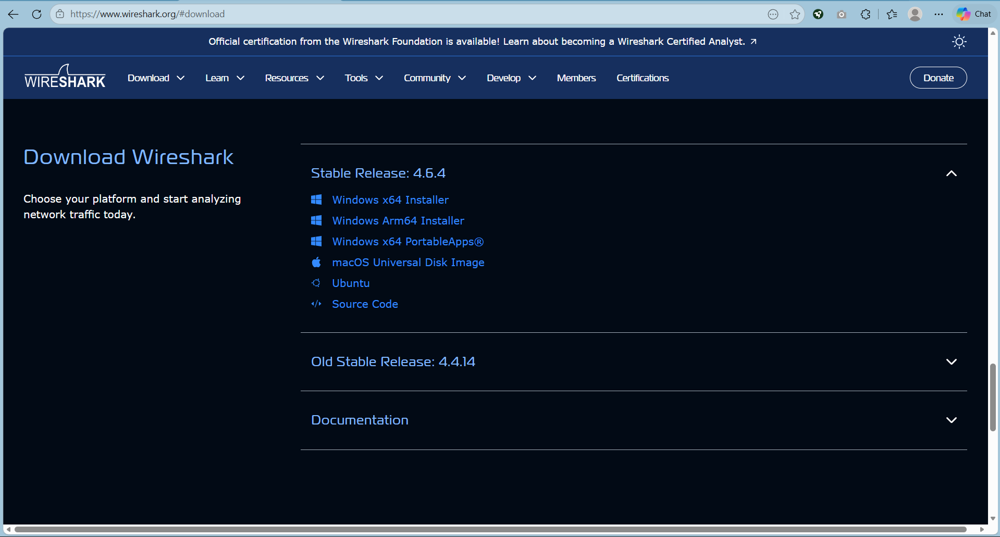
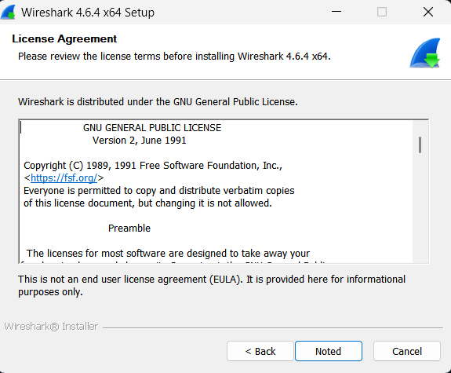
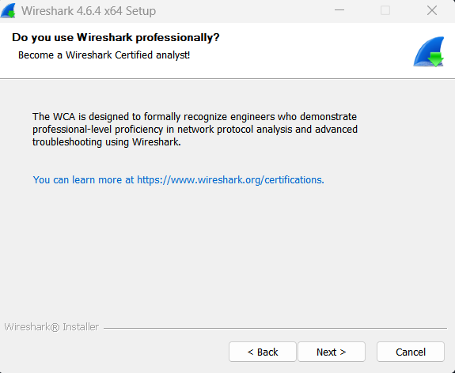
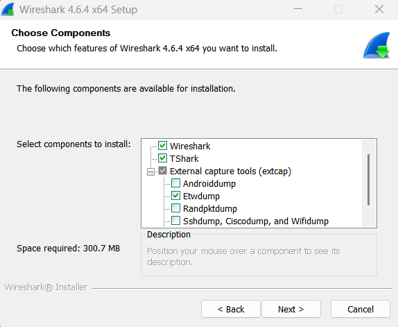
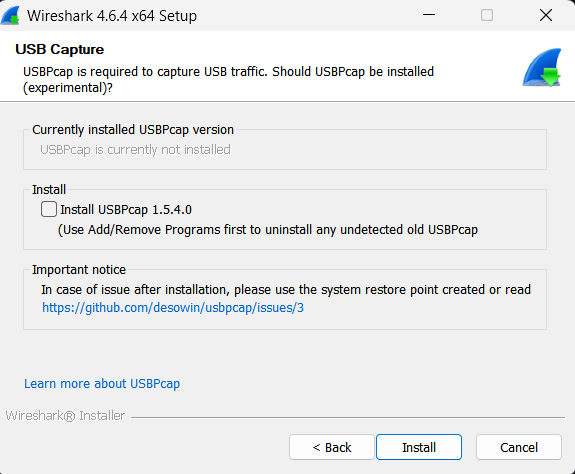
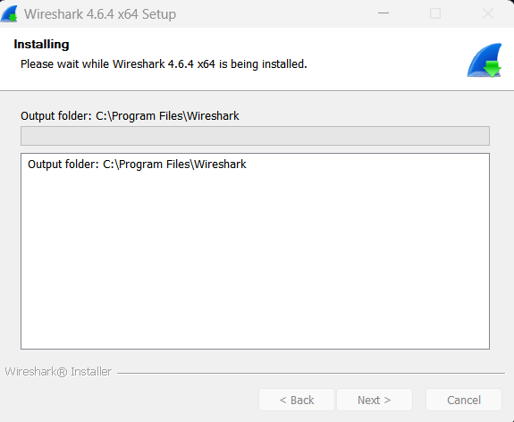
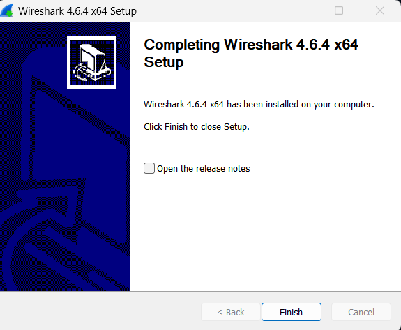
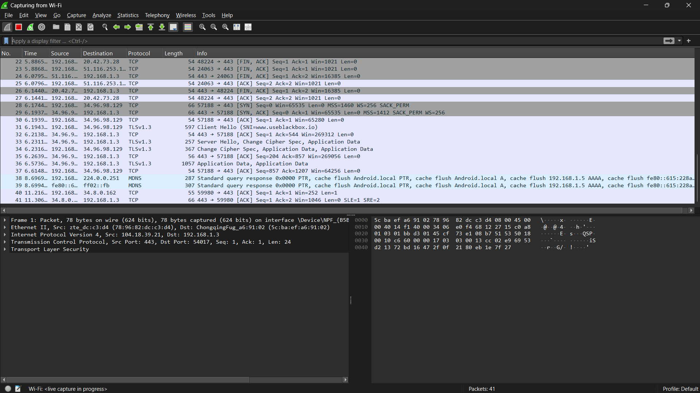
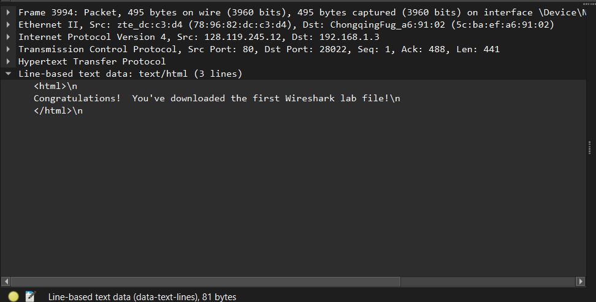

# Laporan Praktikum Week 1

Nama       : Ivan Radithya Tanaya Ardianto<br>
NIM        : 103072430005<br>
Kelas      : IF-04-05<br>
Mata Kuliah: Jaringan Komputer<br>
__________________________________________

<br><br>

## Instalasi Wireshark (modul 1)

### Langkah-langkah instalasi Wireshark:
1. Pergi ke website www.wireshark.org atau buka link ini https://www.wireshark.org/download.html
2. Pilih sesuai dengan OS (Operating System) masing-masing, kemudian download (pilih yang stable version atau versi terbaru)
3. Setelah file didownload klik open file
4. Lakukan installation setup mulai dari peletakan direktori instalasi sampai proses instalasi selesai

<br><br>

### Lampiran
- Download page

- Installation Part 1<br>

- Installation Part 2<br>

- Installation Part 3<br>

- Installation Part 4<br>

- Installation Part 5<br>

- Installation Part 6<br>

- Installation Part 7<br>

- Installation Part 8<br>

- Installation Part 9<br>

- Installation Part 10<br>

- Installation Done<br>


<br><br><br>

## Tugas Praktikum week 1 (modul 2)

### Langkah-langkah basic HTTP GET atau response interaction:
1. Buka Wireshark terlebih dahulu
2. Untuk capture bisa pilih wifi (matikan **VPN** jika menggunakan) dengan cara double klik tulisan wifi
3. Buka link ini http://gaia.cs.umass.edu/wireshark-labs/INTRO-wireshark-file1.html (pastikan di browser pakai http, jika belum bisa coba pakai *browse as guest*)
4. Browser akan menampilkan html sederhana dalam 1 baris "Congratulations! You've downloaded the first Wireshark lab file!"
5. Ketik pada bagian filter di wireshark "http" (tanpa tanda kutip)
6. pilih yang ada tulisan "(text/html)"
7. klik panah pada tulisan "Line-based text data", akan menampilkan: 
```
<html>\n 
Congratulations! You've download the first Wireshark lab file!
</html>\n
```

**Untuk keluar bisa klik stop capture pada menu, kemudian close this capture file**

<br><br>

### Lampiran
- Tampilan Wireshark

- Tampilan Capture from Wi-Fi

- Tampilan Browser pada link html

- Tampilan Capture from Wi-Fi With Filter HTTP

- Line-Based Text Data: text/html from GET html
