# Laporan Praktikum Week 10

<pre>
Nama        : Ivan Radithya Tanaya Ardianto
NIM         : 103072430005
Kelas       : IF-04-05
Mata Kuliah : Jaringan Komputer
</pre>
__________________________________________

 

## ICMP (modul 12)

Apa itu ICMP? ICMP (Internet Control Message Protocol) adalah protokol pendukung IP yang digunakan untuk komunikasi kontrol.

Fungsi ICMP:
<ul>
    <li>
    

    Error reporting &rarr; Memberitahu pengirim jika paket gagal dikirim (contoh: host unreachable, port unreachable).
    
 
    </li>
    <li>
    

    Diagnostics &rarr; Digunakan oleh ping dan traceroute untuk cek konektivitas dan jalur.
    

    </li>
    <li>
    

    Routing support &rarr; Pesan Redirect memberi tahu host agar menggunakan rute lain yang lebih efisien.
    

    </li>
    <li>
    

    Congestion feedback &rarr; Memberikan sinyal jika terjadi masalah seperti TTL (Time To Live) habis.
    

    </li>
</ul>

Mekanisme kerja ICMP:
<ol>
    <li>
    

    Encapsulation &rarr; Pesan ICMP dikirim dalam bentuk paket IP (IP header + ICMP header + data).
    

    </li>
    <li>
    

    Message types &rarr; Ada beberapa pesan, misalnya:
        <ul>
            <li>
            

            Echo Request/Reply &rarr; Dipakai oleh ping.
            

            </li>
            <li>
            

            Destination Unreachable &rarr; Host atau port tidak bisa dijangkau.
            

            </li>
            <li>
            

            Time Exceeded &rarr; TTL habis, apket dibuang.
            

            </li>
            <li>
            

            Redirect &rarr; Router menyarankan jalur lain.
            

            </li>
        </ul>
    

    </li>
    <li>
    

    Checksum &rarr; Memastikan integritas pesan ICMP.
    

    </li>
    <li>
    

    Connections &rarr; Tidak ada sesi atau handshake, hanya kirim pesan langsung.
    

    </li>
</ol>

### ICMP & Ping
Menangkap paket yang dihasilkan oleh program Ping (paket ICMP).

#### Melakukan Percobaan atau Test dengan Melakukan Ping ke www.ust\.hk
<ol>
    <li>Pertama buka wireshark, lalu pilih capture pada Wi-Fi.</li>
    <li>
    Kemudian, buka CMD. Lalu ketik <kbd>ping -n 10 www.ust.hk</kbd>.c                                                                                                                                   
    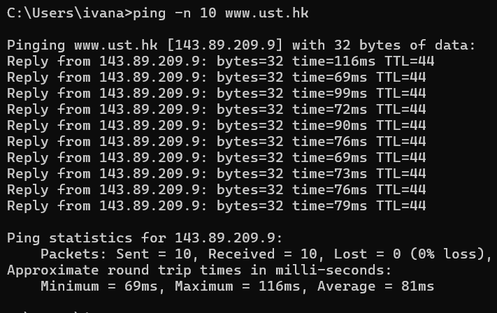 
    </li>
    <li>Lalu stop capturing pada Wi-Fi.</li>
    <li>
    Ketik <kbd>icmp</kbd> pada kolom filter.
    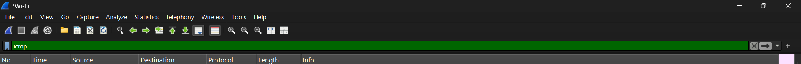 
    </li>
    <li>
    Kemudian, pilih salah satu paket ICMP (termasuk Echo Reply dan Echo Request).
    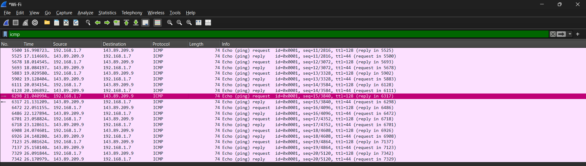 
    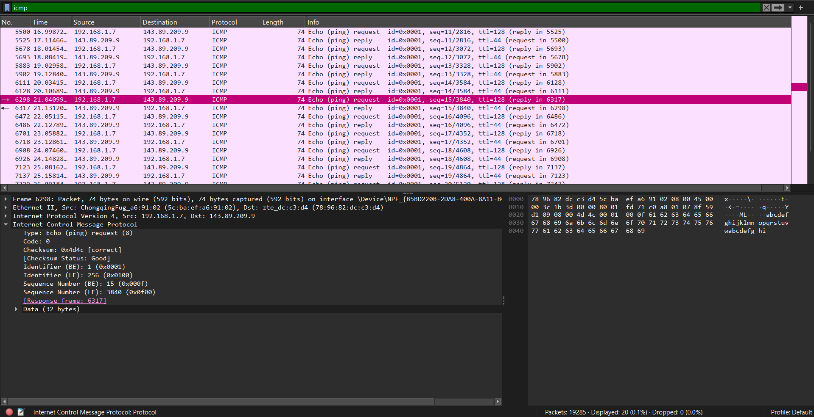 
    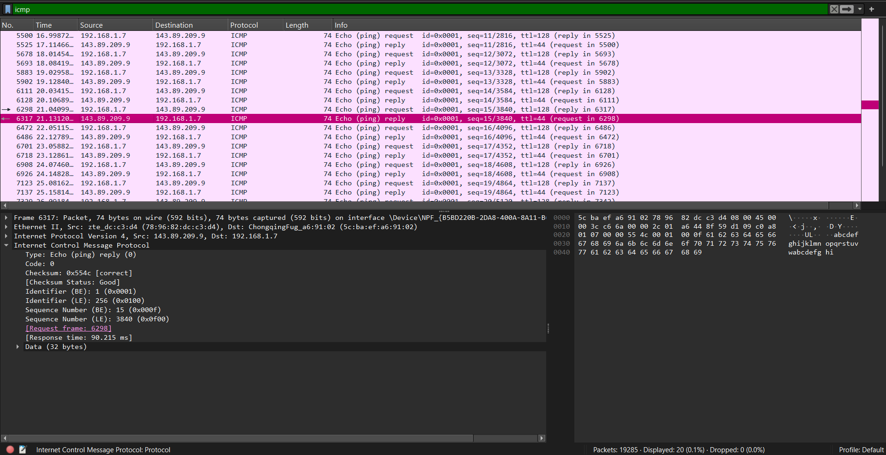 
    </li>
    </li>
    <li>
    Lalu pada bagian packet detail dan expand pada bagian <kbd>Internet Control Message Protocol</kbd>.
     
    dengan isi pesan
    <pre><code>
        Type: Echo (ping) request (8)
        Code: 0
        Checksum: 0x4d4c [correct]
        ...
        Identifier (BE): 1 (0x0001)
        Identifier (LE): 256 (0x0100)
        Sequence Number (BE): 15 (0x000f)
        Sequence Number (LE): 3840 (0x0f00)
        [Response frame: 6317]
    </code></pre>
    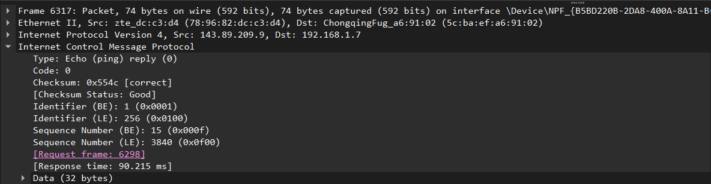 
    dengan isi pesan
    <pre><code>
        Type: Echo (ping) reply (0)
        Code: 0
        Checksum: 0x554c [correct]
        ...
        Identifier (BE): 1 (0x001)
        Identifier (LE): 256 (0x0100)
        Sequence Number (BE): 15 (0x000f)
        Sequence Number (LE): 3840 (0x0f00)
        [Request frame: 6298]
        [Response time: 90.215 ms]
    </code></pre>
    </li>
</ol>

#### Berdasarkan analisis saya:

Dari hasil pengamatan saya, saat menjalankan perintah <kbd>ping -n 10 www.ust.hk</kbd> yang akan melakukan uji konektivitas sebanyak 10 kali ke server atau host www.ust.hk, didapatkan paket ICMP sebanyak 20 (10 Request, 10 Reply) dengan paket <kbd>Echo Request (Type 8, Code 0)</kbd> yang dikirimkan oleh komputer yang kemudian memperoleh balasan berupa paket <kbd>Echo Reply (Type 0, Code 0)</kbd> dari server.

### ICMP & Traceroute
Menangkap paket yang dihasilkan oleh program Traceroute (paket ICMP).

#### Melakukan Percobaan atau Test dengan Melakukan Traceroute ke www.ust\.hk
<ol>
    <li>Pertama buka wireshark, lalu pilih capture pada Wi-Fi.</li>
    <li>
    Kemudian, buka CMD. Lalu ketik <kbd>tracert www.ust.hk</kbd>.
    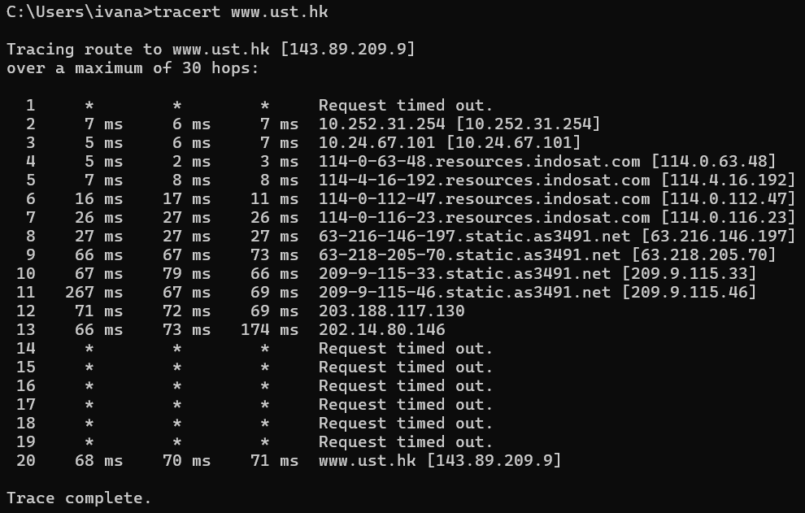 
    </li>
    <li>Lalu stop capturing pada Wi-Fi.</li>
    <li>
    Ketik <kbd>icmp</kbd> pada kolom filter.
    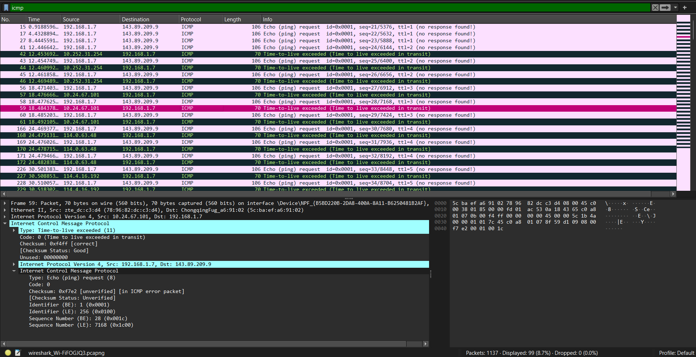 
    </li>
    <li>
    Kemudian, pilih salah satu paket ICMP. Lalu pada bagian packet detail dan expand pada bagian <kbd>Internet Control Message Protocol</kbd>.
    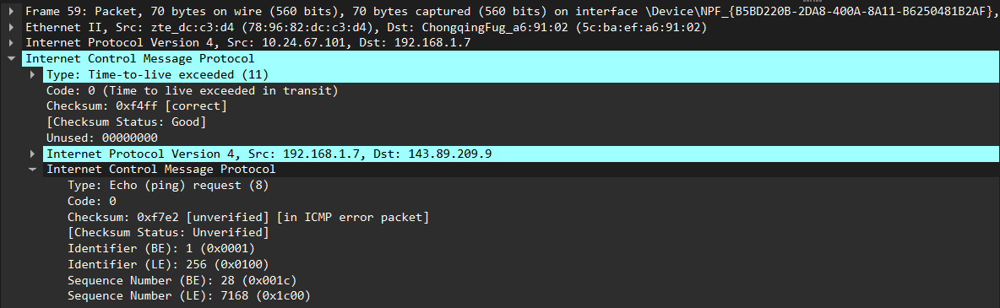 
    dengan pesan
    <pre><code>
        Type: Time-to-live exceeded (11)
        Code: 0 (Time to live exceed in transit)
        Checksum: 0xf4ff [correct]
        ...
        Unused: 00000000
    </code></pre>
    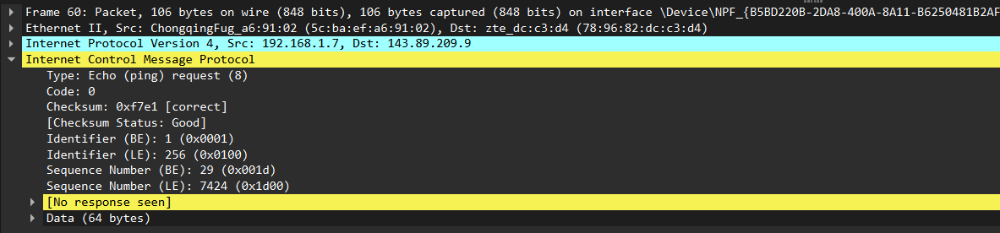 
    dengan pesan
    <pre><code>
        Type: Echo (ping) request (8)
        Code: 0
        Checksum: 0xf7e1 [correct]
        ...
        Identifier (BE): 1 (0x001)
        Identifier (LE): 256 (0x0100)
        Sequence Number (BE): 29 (0x001d)
        Sequence Number (LE): 7424 (0x1d00)
        [No response seen]
    </code></pre>
    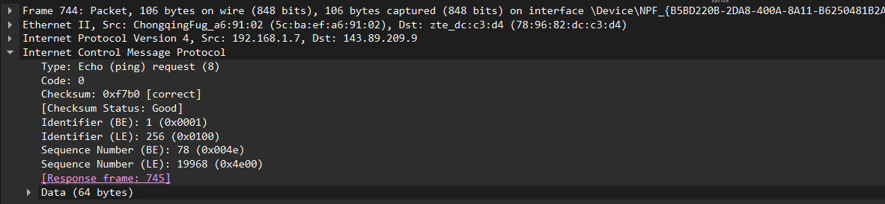 
    dengan pesan
    <pre><code>
        Type: Echo (ping) request (8)
        Code: 0
        Checksum: 0xf7b0 [correct]
        ...
        Identifier (BE): 1 (0x001)
        Identifier (LE): 256 (0x0100)
        Sequence Number (BE): 78 (0x004e)
        Sequence Number (LE): 19968 (0x4e00)
        [Response frame: 745]
    </code></pre>
    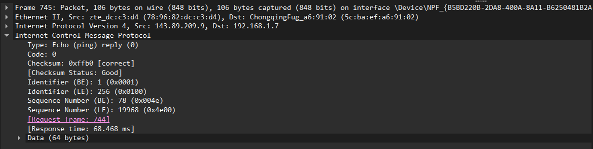 
    dengan pesan
    <pre><code>
        Type: Echo (ping) reply (0)
        Code: 0
        Checksum: 0xffb0 [correct]
        ...
        Identifier (BE): 1 (0x001)
        Identifier (LE): 256 (0x0100)
        Sequence Number (BE): 78 (0x004e)
        Sequence Number (LE): 19968 (0x4e00)
        [Request frame: 744]
        [Response time: 68.468 ms]
    </code></pre>
    </li>
</ol>

#### Berdasarkan analisis saya:

Dari hasil pengamatan saya, saat menjalankan perintah <kbd>tracert www.ust.hk</kbd> terlihat ada paket ICMP yang bertipe <kbd>Time-to-live-exceeded (Type 11, Code 0)</kbd>. Cara kerjanya dengan mengirim paket dengan TTL (Time To Live) secara bertahap, kemudian mencatat router (hop) yang dilewati.

### Kesimpulan

Berdasarkan hasil analisis tadi, dapat diamati bahwa struktur dan isi paket ICMP, seperti Type, Code, Checksum, Identifier, dan Sequence Number memilki peran penting dalam proses pemeantauan, troubleshooting, dan analisis performa dalam jaringan komputer.

