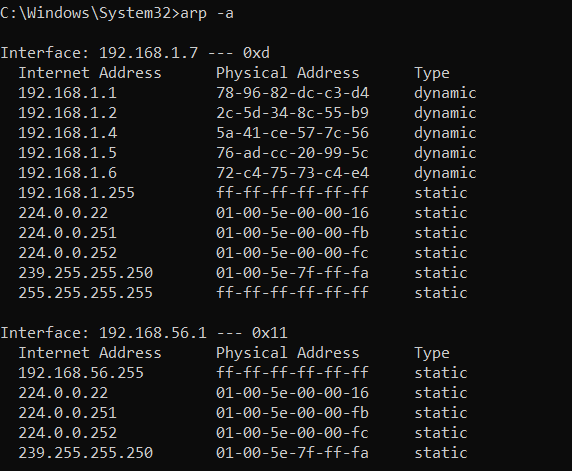
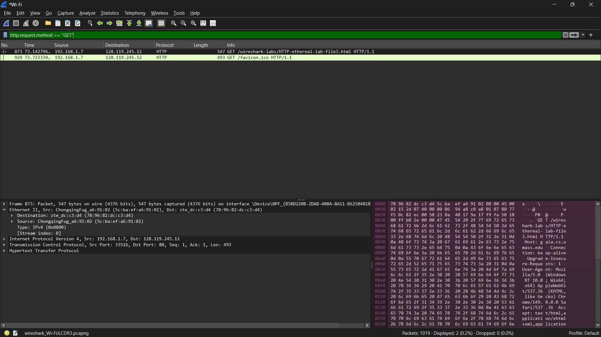
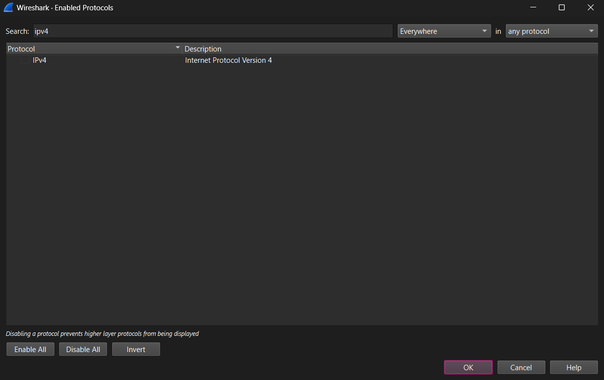
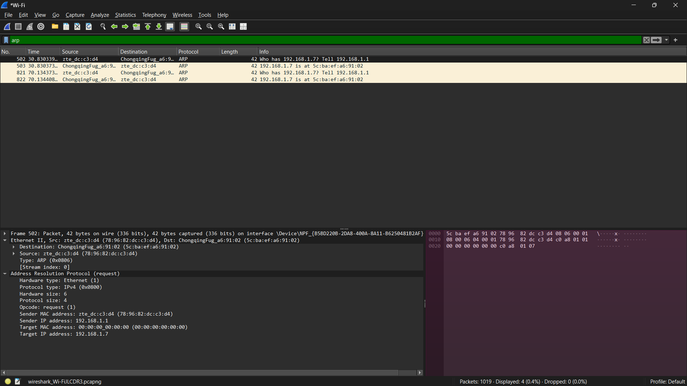
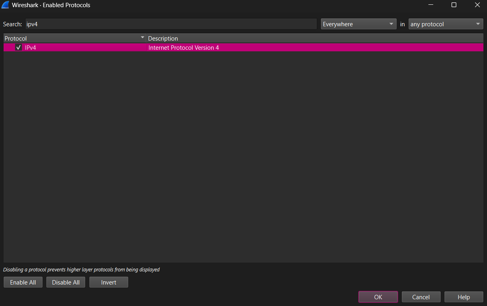

# Laporan Praktikum Week 11

<pre>
Nama        : Ivan Radithya Tanaya Ardianto
NIM         : 103072430005
Kelas       : IF-04-05
Mata Kuliah : Jaringan Komputer
</pre>
__________________________________________

 

## Ethernet & ARP (modul 13)

Ethernet adalah standar utama untuk jaringan kabel (LAN) yang digunakan di runah, kantor, dan pusat data. Sedangkan ARP (Address Resolution Protocol) adalah protokol yang menerjemahkan alamat IP menjadi alamat MAC agar perangkat bisa saling berkomunikasi di jaringan lokal.

### Caching ARP
<ul>
<li>
Dengan mengetikkan perintah <kbd>arp -a</kbd> pada cmd <Strong>as administrator</Strong>.
 
Digunakan untuk menampilkan isi dari ARP cache yang ada di komputer.
</li>
<li>
Dengan mengetikkan perintah <kbd>arp -d *</kbd> pada cmd <Strong> as administrator</Strong>. Dengan perintah ini, semua entri di cache akan dihapus.
</li>
</ul>

### Langkah-Langkah Percobaan
<ol>
    <li>Pertama buka wireshark, lalu pilih capture pada Wi-Fi.</li>
    <li>
    Kemudian masuk ke halaman web ini <a href= https://gaia.cs.umass.edu/wireshark-labs/HTTP-ethereal-lab-file3.html>https://gaia.cs.umass.edu/wireshark-labs/HTTP-ethereal-lab-file3.html</a>.
     
    </li>
    <li>Lalu stop capturing pada Wi-Fi.</li>
    <li>
    Lalu ketik pada bagian filter <kbd>http.request.method == "GET"</kbd>
     
    

    Dengan adanya filter ini, hanya akan menampilkan http GET saja. Isinya (informasi pada Ethernet II) ada Destination, Source, Type, dan Stream Index. Dengan IP tujuan 128.119.245.12 dan sumber 192.168.1.7.
    

    </li>
    <li>
    Selanjutnya pilih menu analyze yang ada diatas. Lalu masuk ke enabled protocol &rarr; filter ipv4 dan un-check list &rarr; klik OK.
     
    </li>
    <li>
    Lalu ketik pada bagian filter <kbd>arp</kbd>.
     
    

    Pada gambar ini terdapat ARP request dan reply. Isinya (informasi pada Address Resolution Protocol) ada Hardware type, Protocol type, Hardware size, Protocol size, Opcode, Sender MAC address, Sender IP address, Target MAC address, dan Target IP address. Untuk informasi pada Ethernet II dengan tujuan 5c:ba:ef:a6:91:02 (ChongqingFug_a6:91:02) dan sumber 78:96:82:dc:c3:d4 (zte_dc:c3:d4).
    

    </li>
    <li>
    Sebelum close wireshark, check list lagi ipv4 yang ada di analyze &rarr; enabled protocol.
     
    </li>
</ol>