# Laporan Praktikum Week 2

<pre>
Nama        : Ivan Radithya Tanaya Ardianto<br>
NIM         : 103072430005<br>
Kelas       : IF-04-05<br>
Mata Kuliah : Jaringan Komputer
</pre>
__________________________________________

<br>

## Deskripsi Singkat
<p>
Pada laporan kali ini akan menjelaskan langkah-langkah tentang HTTP. Seperti Basic HTTP GET/Response Interaction, HTTP CONDITIONAL GET/Response Interaction, HTTP Message formats, HTML File with Embedded Objects, serta HTTP Authentication and Security. Secara sederhananya, ini merupakan cara browser mengambil halaman web dari server.
</p><br>

## HTTP (modul 3)

### HTTP GET

#### Basic HTTP GET/Response Interaction

##### Penjelasan Singkat
Basic GET HTTP/response interaction merupakan proses komunikasi dasar antara client dan server di web yang menggunakan metode HTTP GET untuk meminta suatu resource, lalu server akan mengirimkan HTTP response sebagai balasannya.

##### Langkah-langkah basic HTTP GET/response interaction:
1. Buka Wireshark terlebih dahulu
2. Untuk capture bisa pilih wifi (matikan **VPN** jika menggunakan) dengan cara double klik pada tulisan wifi
3. Buka link ini http://gaia.cs.umass.edu/wireshark-labs/INTRO-wireshark-file1.html (pastikan di browser *pakai http*, jika belum bisa coba pakai *browse as guest*)
4. Browser akan menampilkan html sederhana dalam 1 baris "Congratulations! You've downloaded the first Wireshark lab file!"
5. Ketik pada bagian filter di wireshark "http" (tanpa tanda kutip)
6. pilih yang ada tulisan "(text/html)"
7. klik panah pada tulisan "Line-based text data", akan menampilkan: 
```
<html>\n 
Congratulations! You've download the first Wireshark lab file!
</html>\n
```

**Untuk keluar bisa klik stop capture pada menu, kemudian close this capture file**
*<small style="font-size:80%;">Sama seperti laporan pada minggu pertama</small>*<br>

##### Lampiran
- Tampilan Wireshark
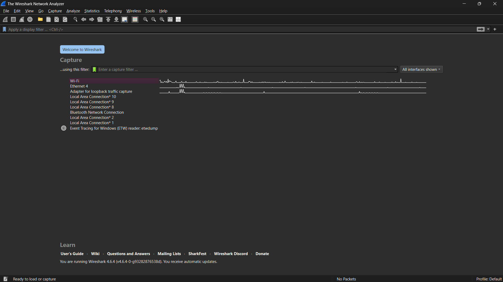
- Tampilan Capture from Wi-Fi

- Tampilan Browser pada link html
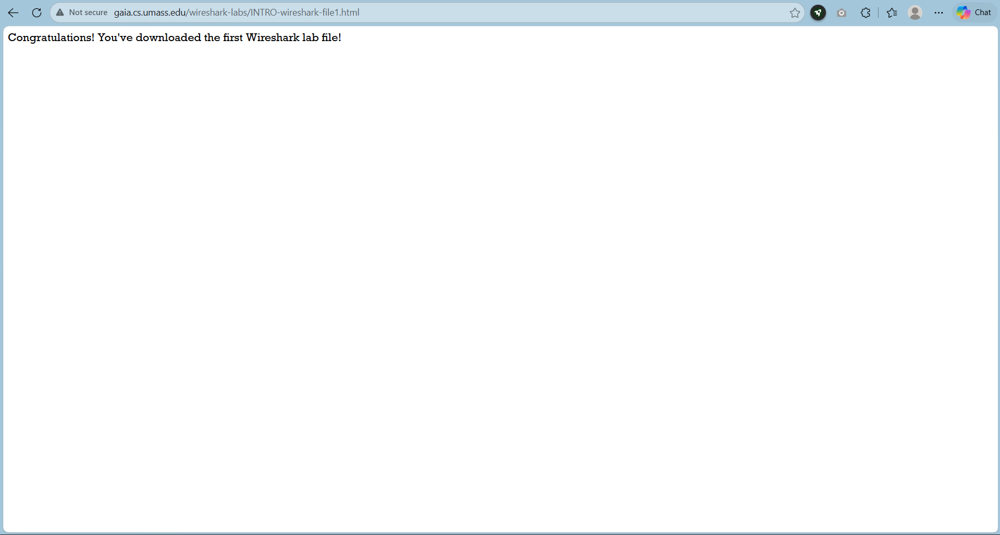
- Tampilan Capture from Wi-Fi With Filter HTTP
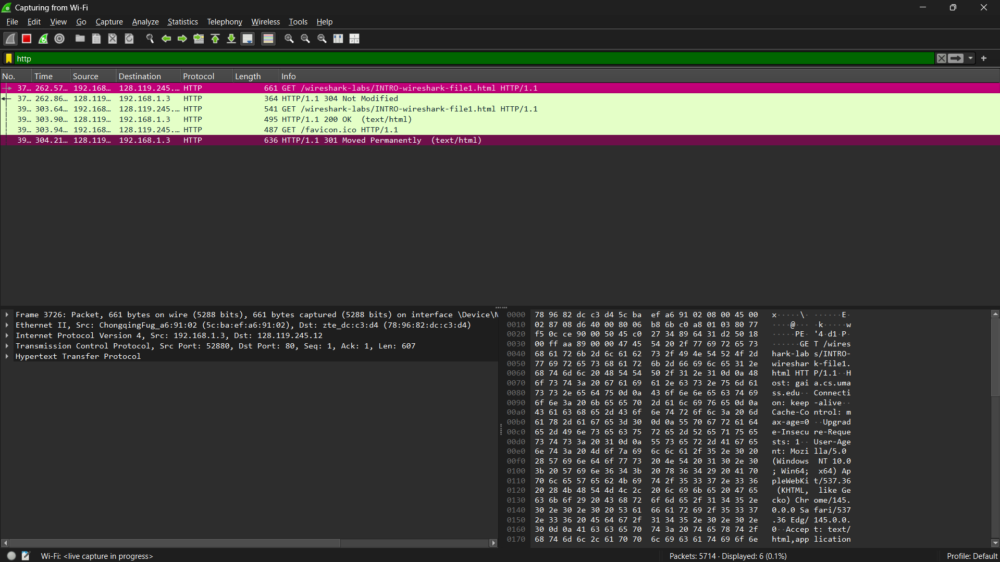
- Line-Based Text Data: text/html from GET html Normal
<br><br><br>

#### HTTP CONDITIONAL GET/Response Interaction

##### Penjelasan Singkat
<p>
HTTP conditional/response interaction merupakan mekanisme dalam protokol HTTP di mana client meminta resource dari server hanya jika resource tersebut telah (berubah sejak terakhir diambil). Jika tidak ada perubahan, maka server tidak akan mengirim ulang data, sehingga menghemat bandwidth dan mempercepat loading.
</p><br>

##### Langkah-langkah HTTP CONDITIONAL GET/response interaction:
1. Buka Wireshark terlebih dahulu
2. Untuk capture bisa pilih wifi (matikan **VPN** jika menggunakan) dengan cara double klik pada tulisan wifi
3. Buka link ini http://gaia.cs.umass.edu/wireshark-labs/HTTP-wireshark-file2.html (pastikan di browser *pakai http*, jika belum bisa coba pakai *browse as guest* dan *pastikan telah menghapus cache atau history browser anda*)
4. Browser akan menampilkan html berupa text based yaitu: 
   <pre>
   "Congratulations again! Now you've downloaded the file lab2-2.html." 
   "This file's last modification date will not change."

   "Thus if you download this multiple times on your browser, a complete copy"
   "will only be sent once by the server due to the inclusion of the IN-MODIFIED-SINCE"
   "field in your browser's HTTP GET request to the server."
   </pre>
   **Tanpa menggunakan tanda kutip**
5. Ketik pada bagian filter di wireshark "http" (tanpa tanda kutip)
6. klik pada bagian GET HTML, apakah isi pada Hypertext Transfer Protocol (kalau belum keluar klik panah pada tulisan Hypertext Tranfer Protocol) terdapat tulisan "If-Modified-Since". Jika belum kembali ke browser yang sudah membuka link tersebut, kemudian refresh. Cek kembali GET HTML pastikan ada "If-Modified-Since".
6. pilih yang ada tulisan "(text/html)"
7. klik panah pada tulisan "Line-based text data", akan menampilkan:
```
\n
<html>\n
\n
This file's last modification date will not change. <p>\n
Congratulations again! Now you've download the file lab2-2.html. <br>\n
Thus if you download this multiple times your browser, a complete copy <br>\n
will only be sent once by the server due to the inclusion of the IN-MODIFIED-SINCE<br>\n
field in your browser's HTTP GET request to the server.\n
\n
</html>\n
```

*If-Modified-Since memiliki waktu terakhir kali diubah pada server, bukan pada saat waktu anda refresh browser tersebut*<br>
**Untuk keluar bisa klik stop capture pada menu, kemudian close this capture file**<br>

##### Lampiran
- Tampilan Wireshark

- Tampilan Capture from Wi-Fi

- Tampilan Browser pada link html

- Tampilan Capture from Wi-Fi With Filter HTTP
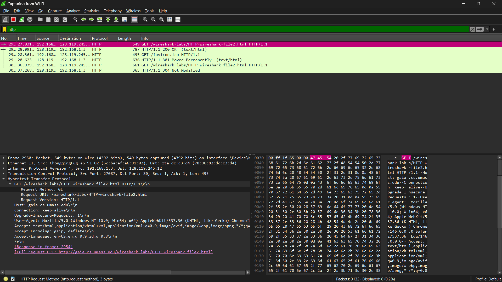
- Hypertext Transfer Protocol 1 (clear history or cache first)
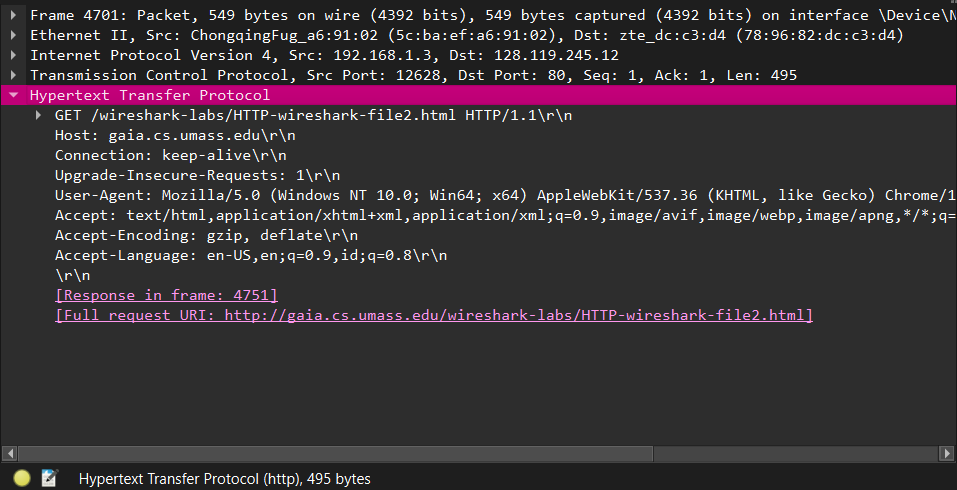
- Hypertext Transfer Protocol 2 (setelah refresh)
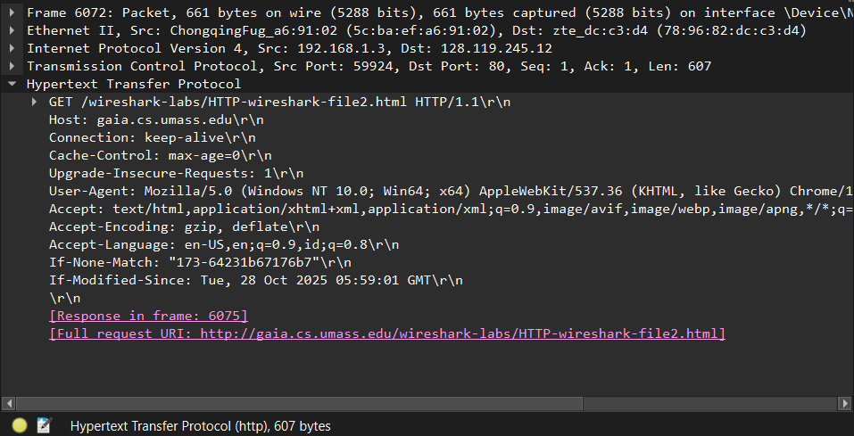
- Line-Based Text Data: text/html from GET html Conditional
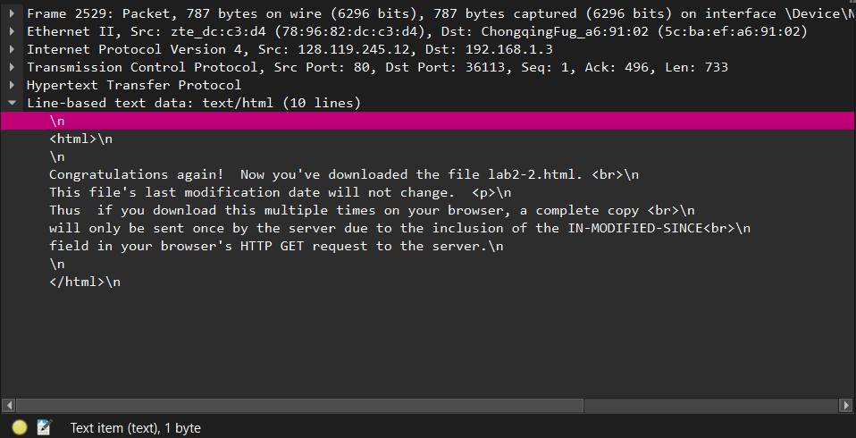<br><br><br>

### HTTP Message Formats

#### Penjelasan Singkat
<p>
HTTP message formats merupakan struktur atau format pesan yang digunakan dalam komunikasi HTTP antara client dan server. Pesannya biasanya berupa browser yang mengirim pesan request (dari client ke server) dan server yang mengirim pesan response (dari server ke client).
</p><br>

#### Langkah-langkah HTTP message formats:
1. Buka Wireshark terlebih dahulu
2. Untuk capture bisa pilih wifi (matikan **VPN** jika menggunakan) dengan cara double klik pada tulisan wifi
3. Buka link ini http://gaia.cs.umass.edu/wireshark-labs/HTTP-wireshark-file3.html (pastikan di browser *pakai http*, jika belum bisa coba pakai *browse as guest* dan *pastikan telah menghapus cache atau history browser anda*)
4. Browser akan menampilkan html yang panjang, berjudul "Historical Documents: THE BILL OF RIGHTS"
5. Ketik pada bagian filter di wireshark "http" (tanpa tanda kutip)
6. Cari GET HTTP dari filter tadi, lalu klik panah pada tulisan "Hypertext Transfer Protocol" diantaranya yang buat request dan response
7. Di bagian response ini (pada tulisan HTTP/1.1 200 OK) mengirimkan (text/html) dengan long text, sesuai dengan teks yang ada di web html-nya

**Untuk keluar bisa klik stop capture pada menu, kemudian close this capture file**<br>

#### Lampiran
- Tampilan Wireshark

- Tampilan Capture from Wi-Fi

- Tampilan Browser pada link html part 1
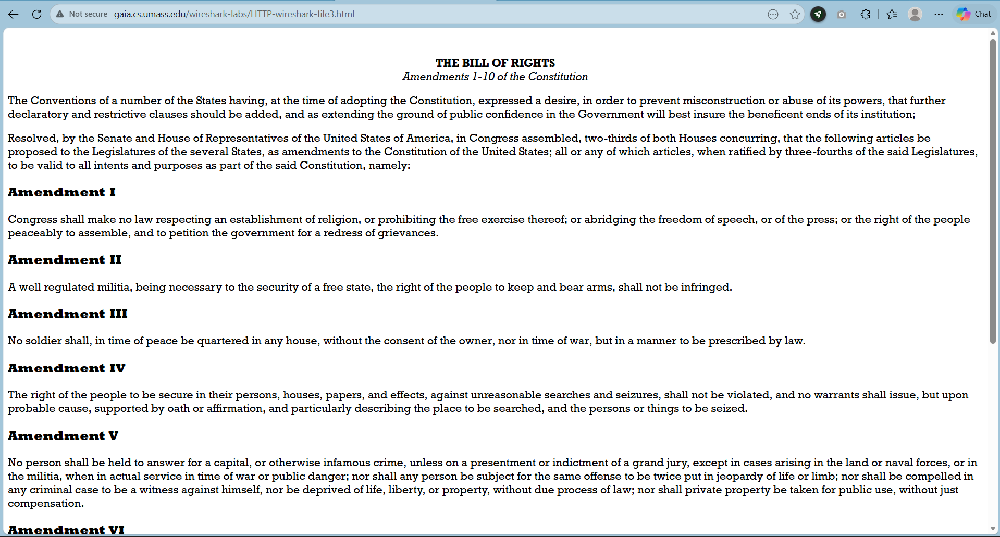
- Tampilan Browser pada link html 3 part 2
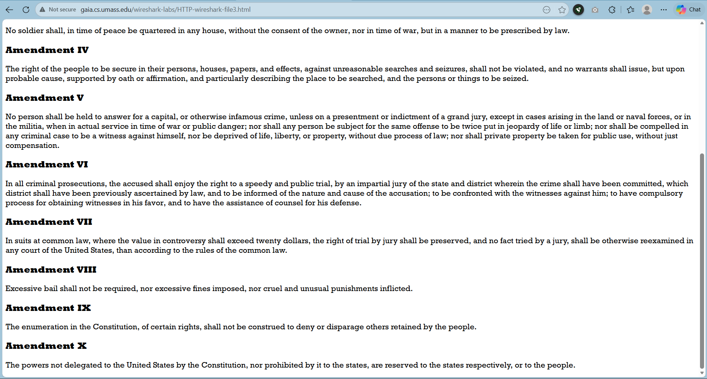
- Tampilan Capture from Wi-Fi With Filter HTTP
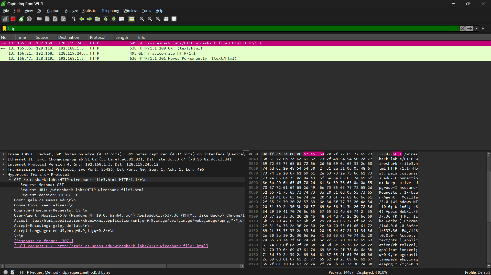
- Hypertext Transfer Protocol 1 (Request)
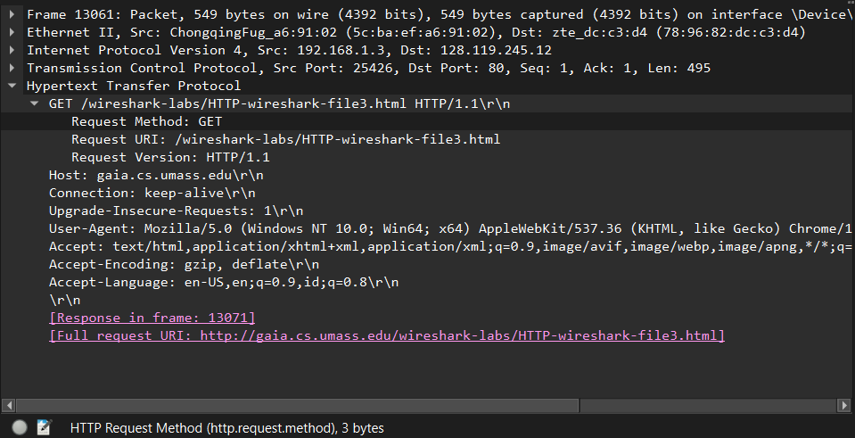
- Hypertext Transfer Protocol 2 (Response)
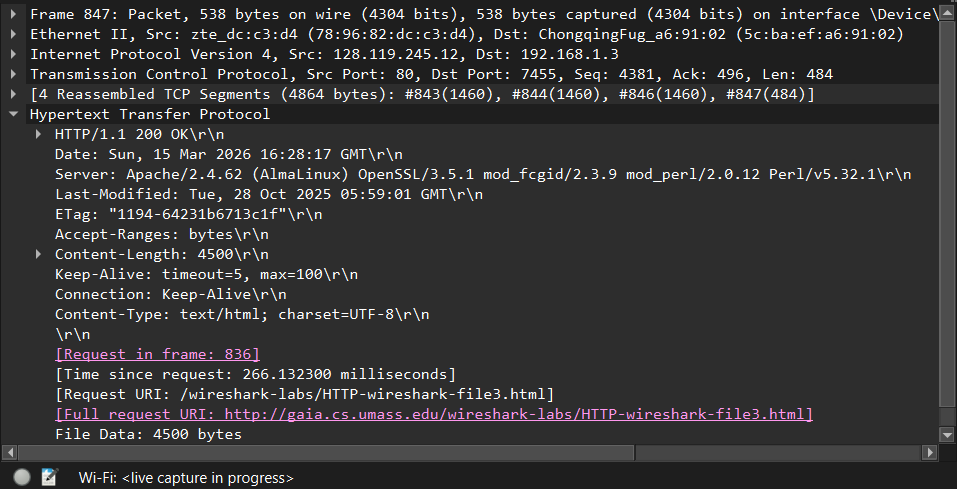
- Line-Based Text Data: text/html (long text)
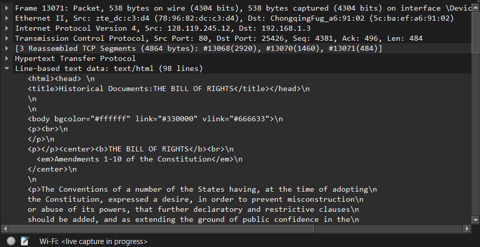<br><br><br>

### HTTP File with Embedded Objects

#### Penjelasan Singkat
<p>
HTTP file with embedded objects merupakan sebuah file utama yang berisi objek-objek lain seperti gambar, CSS, atau JavaScript yang juga harus diambil dari server.
</p><br>

#### Langkah-langkah HTTP file with embedded objects:
1. Buka Wireshark terlebih dahulu
2. Untuk capture bisa pilih wifi (matikan **VPN** jika menggunakan) dengan cara double klik pada tulisan wifi
3. Buka link ini http://gaia.cs.umass.edu/wireshark-labs/HTTP-wireshark-file4.html (pastikan di browser *pakai http*, jika belum bisa coba pakai *browse as guest* dan *pastikan telah menghapus cache atau history browser anda*)
4. Browser menampilkan text html, gambar, dan logo
5. Ketik pada bagian filter di wireshark "http" (tanpa tanda kutip)
6. Hentikan capture dengan klik "Stop capturing packets"
7. Cari GET HTTP dari filter tadi ada yang beda dari HTTP sebelumnya yaitu GET /pearson.png HTTP/1.1 dan GET /8E_cover_small.jpg HTTP/1.1 
8. Cek status GET HTTP tadi dengan cara klik panah pada tulisan "Hypertext Transfer Protocol"
9. Di bagian response ini bukan hanya (text/html), tapi juga (JPEG JFIF image)
10. Klik info yang bertuliskan "(JPEG JFIF image)", lalu klik panah pada tulisan "JPEG File Interchange Format"
11. Di bagian JPEG FIle interchange FOrmat ini merupakan format hasil kompresi JPEG

**Untuk keluar bisa klik stop capture pada menu (jika belum), kemudian close this capture file**<br>

#### Lampiran
- Tampilan Wireshark

- Tampilan Capture from Wi-Fi

- Tampilan Browser pada link html
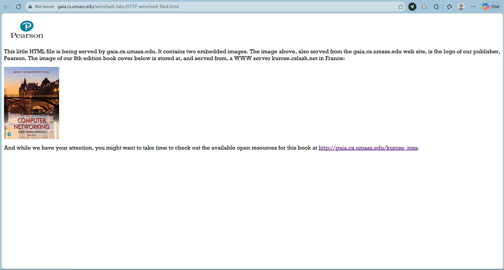
- Hypertext Transfer Protocol 3 (Pearson.png)
- Tampilan Capture from Wi-Fi With Filter HTTP
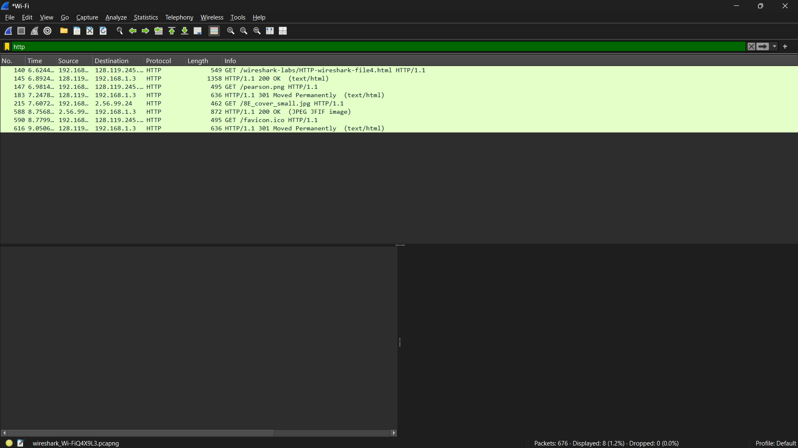
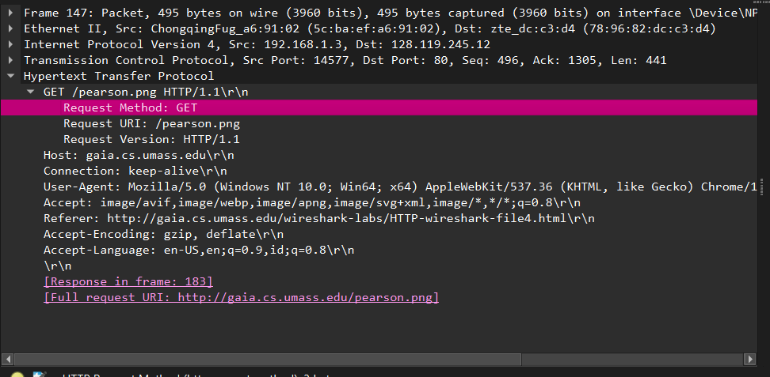
- Hypertext Transfer Protocol 4 (8E_cover_small.jpg)
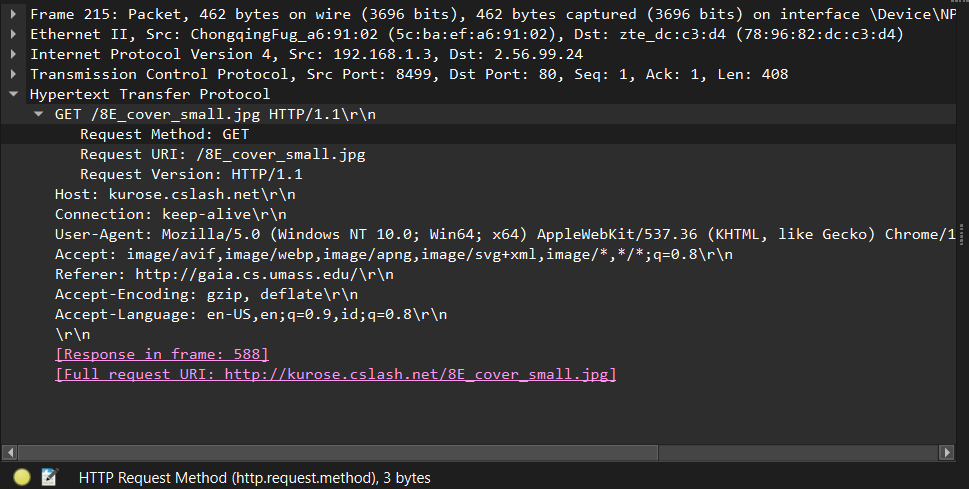
- JPEG FIle Interchange Format
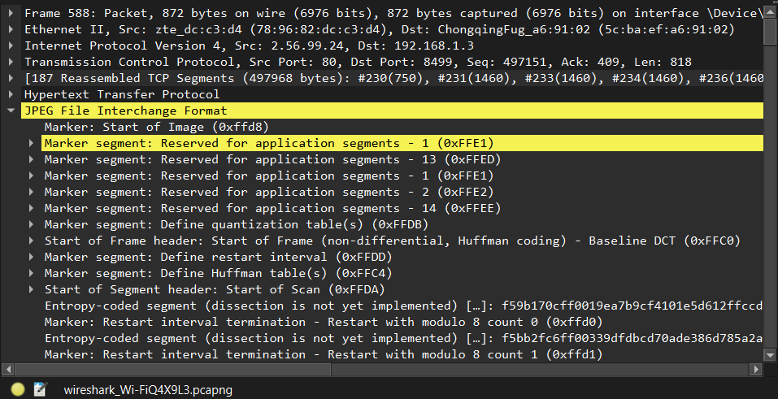<br><br><br>

### HTTP Authentication And Security

#### Penjelasan Singkat
<p>
HTTP authentication and security merupakan konsep dalam HTTP ynag digunakan untuk memverifikasi identitas pengguna (authentication) dan melindungi data yang dikirimkan antara client dan server (security).
</p><br>

#### Langkah-langkah HTTP authentication and security:
1. Buka Wireshark terlebih dahulu
2. Untuk capture bisa pilih wifi (matikan **VPN** jika menggunakan) dengan cara double klik pada tulisan wifi
3. Buka link ini http://gaia.cs.umass.edu/wireshark-labs/protected_pages/HTTP-wireshark-file5.html (pastikan di browser *pakai http*, jika belum bisa coba pakai *browse as guest* dan *pastikan telah menghapus cache atau history browser anda*)
4. Saat masuk browser akan dimintai username dan password, inputkan "wireshark-students" sebagai username dan "network" sebagai password tanpa tanda kutip, kemudian klik Sign in
5. Browser akan menampilkan html sederhana dalam 2 baris yaitu:
   <pre>
   "This page is password protected! If you're seeing this, you've downloaded the page correctly"
   "Congratulations!"
   </pre>
6. Ketik pada bagian filter di wireshark "http" (tanpa tanda kutip)
7. Hentikan capture dengan klik "Stop capturing packets"
8. Cek authorization GET HTTP tadi dengan cara klik panah pada tulisan "Hypertext Transfer Protocol"
9. klik pada tulisan "Authorization" (jika tulisan "Credentials" belum ada), pada bagian credentials ada pola seperti username: password yang didekode dari Authorization: Basic yang berbentuk string (dalam format Base64)

**Untuk keluar bisa klik stop capture pada menu (jika belum), kemudian close this capture file**<br>

#### Lampiran
- Tampilan Wireshark

- Tampilan Capture from Wi-Fi

- Tampilan Browser pada link html 5 dengan username atau password salah

- Tampilan Browser pada link html 5 dengan username atau password benar
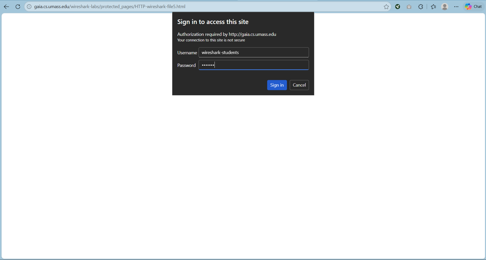
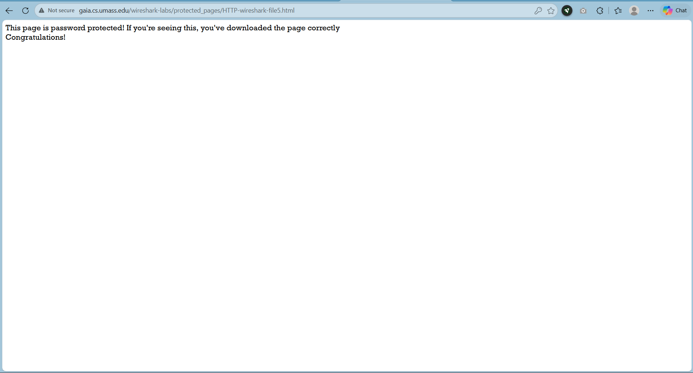
- Tampilan Capture from Wi-Fi With Filter HTTP
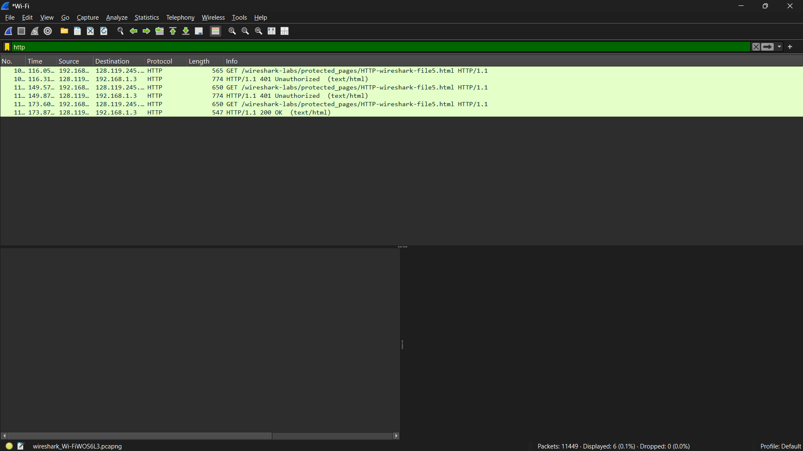
- Hypertext Transfer Protocol Authorization saat username atau password salah
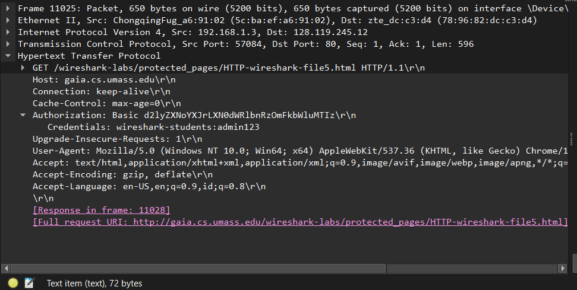
- Hypertext Transfer Protocol Authorization saat username atau password benar
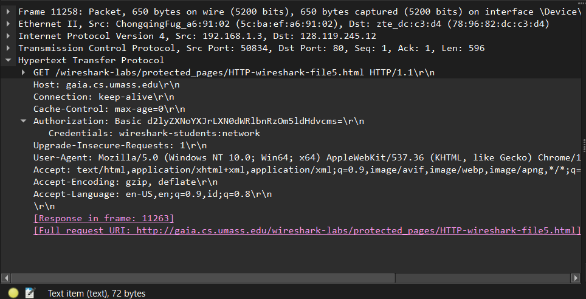
- Line-Based Text Data: text/html saat username atau password salah
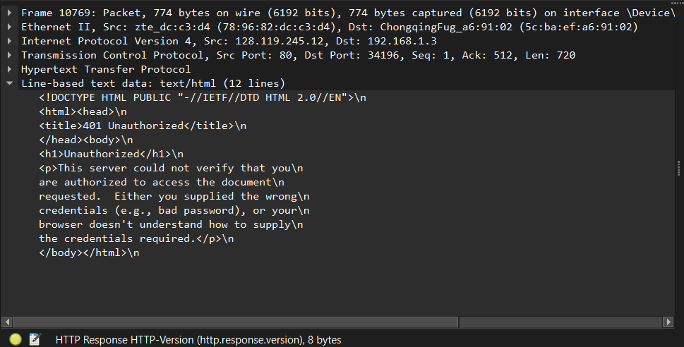
- Line-Based Text Data: text/html saat username atau password benar
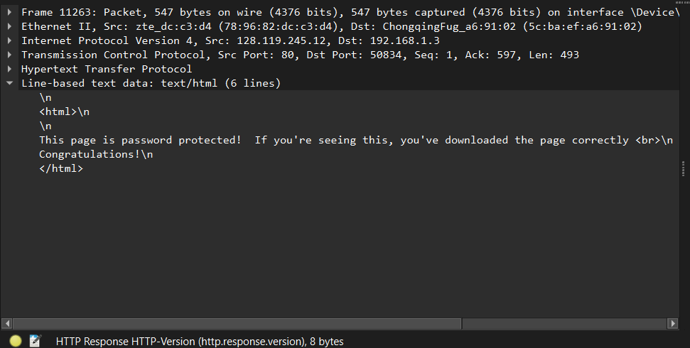