# Laporan Praktikum Week 3
<pre>
Nama        : Ivan Radithya Tanaya Ardianto
NIM         : 103072430005
Kelas       : IF-04-05
Mata Kuliah : Jaringan Komputer
</pre>
___________________________________________

## DNS (modul 4)
<p align="justify">
DNS atau Domain Name System adalah sistem penamaaan internet yang menerjemahkan nama domain (yang dapat dibaca oleh manusia) menjadi alamat IP. Contoh: "Cloudflare" menjadi "1.1.1.1".
</p>

### Nslookup
**Melakukan perintah**
```
nslookup www.mit.edu
```
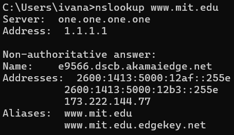
<br>
<p align="justify">
Pada CMD (Command Prompt), saya mendapatkan server "one.one.one.one" dan address "1.1.1.1" yang saya buka di laptop. Berbeda dengan yang ada pada modul yaitu server "dns-prime.poly.edu" (yang menjadi DNS kampus Polytechnic University, Amerika) dan address "128.238.29.22" (DNS lokal kampus Polytechnic University). Kenapa punya saya beda dari DNS pada modul? Karena pada laptop saya sedang menggunakan DNS dari Cloudflare sebagai DNS resolver-nya.
</p>

```
nslookup –type=NS mit.edu
```
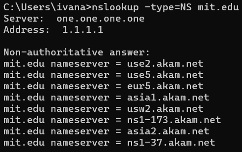<br>
<p align="justify">
Pada gambar diatas nslookup mengirim permintaan nama host dari DNS otoritatif mit.edu (record tipe-NS jika menggunakan -type=NS dan record type-A jika menggunakan opsi default). Tetapi hasil yang didapat pada gambar menunjukkan jawaban yang diberikan berupa "Non-authoritative answer" (non otoritatif) yang berasal dari cache beberapa server bukan langsung dari domain mit.edu yang memiliki otoritatif ke server DNS otoritatif MIT.
</p>

```
nslookup www.aiit.or.kr bitsy.mit.edu
```
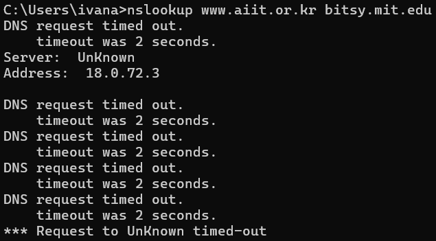<br>
<p align="justify">
Pada gambar diatas nslookup mengrim permintaan ke server DNS bitsy mit.edu (bukan ke default server "dns-prime.poly.edu"), yang kemudian memberikan address (alamat IP) dari host www.aiit.or.kr (merupakan server web di Advanced Institute of Information Technology (di Korea)).
</p>

<p>Sintaks umum nslookup: </p>

```
nslookup –option1 –option2 host-to-find dns-server
```
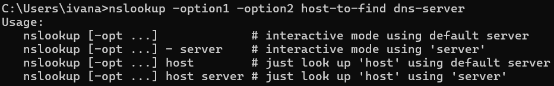<br>
<p align="justify">
Seperti pada gambar diatas, nslookup dapat dijalankan dengan nol, satu, dua, atau lebih opsi dan pengisian DNS server bersifat opsional (jika tidak diisi permintaan akan dikirimkan ke default server DNS lokal).
</p>
<p>Tugas mandiri di modul: </p>
<ol>
    <li>Jalankan nslookup untuk mendapatkan alamat IP dari server web di Asia. Berapa alamat IP server tersebut?</li>
    <li>Jalankan nslookup agar dapat mengetahui server DNS otoritatif untuk universitas di Eropa.</li>
    <li>Jalankan nslookup untuk mencari tahu informasi mengenai server email dari Yahoo! Mail melalui salah satu server yang didapatkan di pertanyaan nomor 2. Apa alamat IP-nya?</li>
</ol>

<p>Jawaban: </p>
<ol>
    <li>
    <p>Mendapat alamat IP dari sever web Asia</p>
        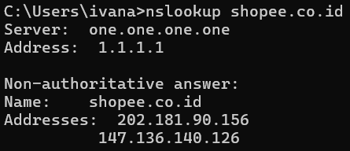<br>
        <p align="justify">
        IP address yang didapatkan adalah 202.181.90.156 dan 147.136.140.126 yang merupakan lokasi dari server fisik milik Shopee (di Singapura). Sementara itu, 1.1.1.1 merupakan IP address dari DNS Cloudflare yang berfungsi sebagai public recursive DNS resolver.
        </p>
    </li>
    <li>
        <p>Mengetahui server DNS otoritatif universitas di Eropa</p>
        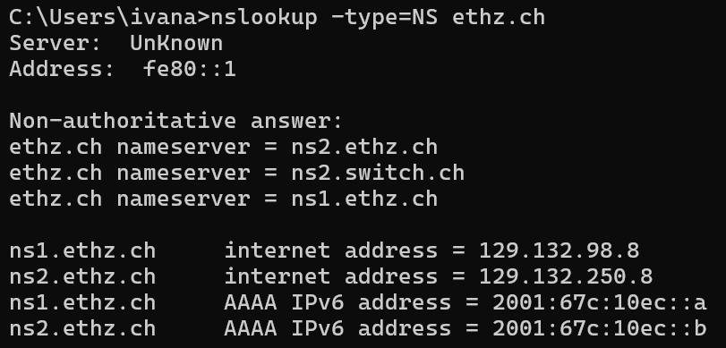<br>
        <p align="justify">
        Pada web dari universitas ETH Zurich (Eidgenössische Technische Hochschule Zürich) dicari menggunakan "nslookup -type=NS" untuk melihat server yang memegang authority (otoritas). Contohnya seperti "ethz.ch nameserver = ns2.ethz.ch".
        </p>
    </li>
    <li>
        <ul>
            <li>Mencari server dari email yahoo dengan salah satu server universitas dari Eropa
                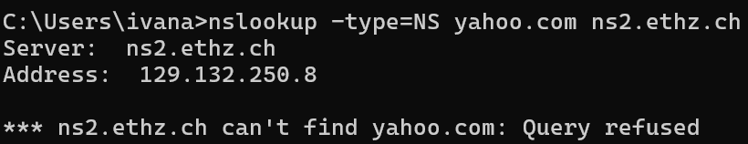<br>
                <p align="justify">
                Menggunakan DNS server dari universitas ETH Zurich ternyata hanya bisa melayani domain-nya sendiri.
                </p>
            </li>
            <li>Mencari server dari email yahoo dengan public DNS (1.1.1.1 atau 8.8.8.8)
                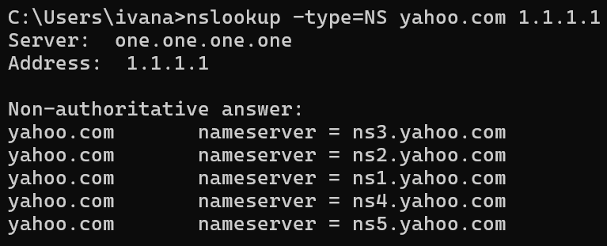<br>
                <p align="justify">
                Pada gambar diatas saya menggunakan DNS publik dari 1.1.1.1 milik Cloudflare untuk mengetahui nama server dari email yahoo (yahoo.com). Dari yang didapatkan dari command prompt dengan DNS publik ada 5 nama server pada domain yahoo.com.
                </p>
            </li>
        </ul>
    </li>
</ol>

### Ipconfig
**Melakukan perintah**
```
ipconfig /all
```
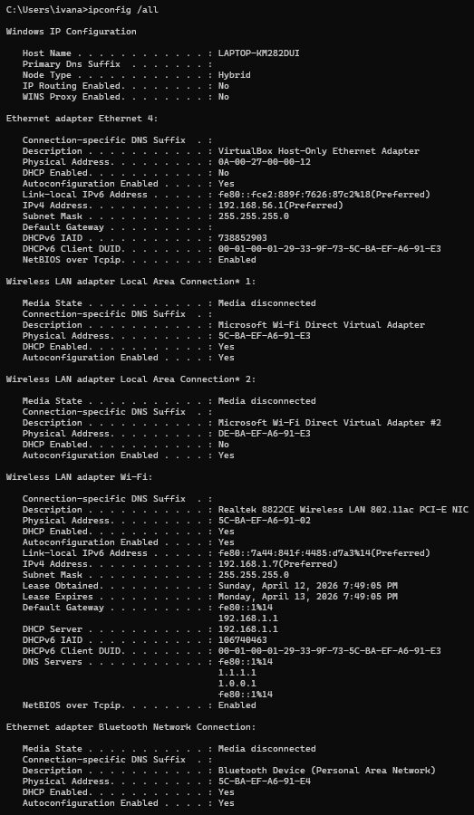<br>
<p>Menampilkan semua rincian konfigurasi jaringan pada komputer atau laptop saat ini.</p>

```
ipconfig /displayall
```
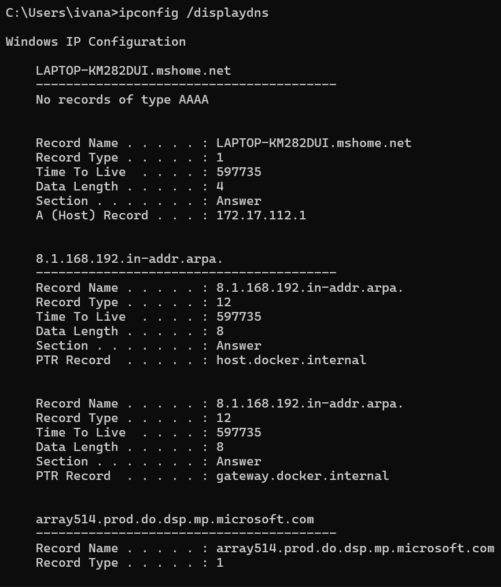<br>
<p>Catatan DNS yang ke record dan sisa TIme to Live (TTL) dalam satuan detik.</p>

```
ipconfig /flushdns
```
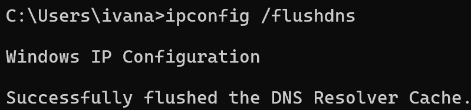<br>
<p>Mengosongkan semua catatan DNS yang ke record, kemudian memuat ulang record dari file host.</p>

### Tracing DNS dengan Wireshark
Pertama kosngkan terlebih dahulu cacatan DNS host.
<br>

Kemudian buka broswer dan kosongkan cache-nya.
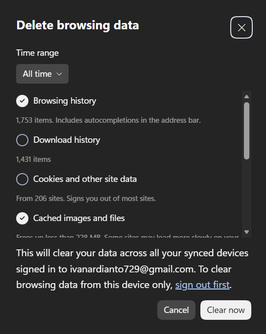<br>

Ketik "ipconfig" pada command prompt, kemudian scroll ke bagian IP Wi-Fi dan catatan IP-nya (digunakan untuk filter).
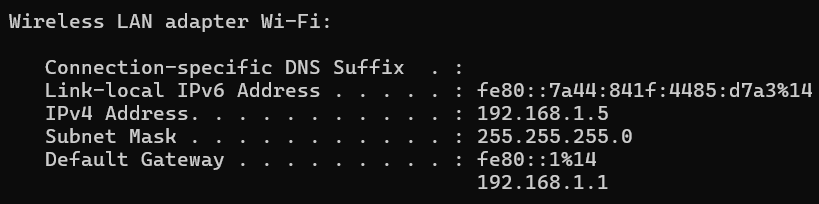<br>
Setelah mematikan IPv6 pada adapter Wi-Fi (karena default dari gateway mengarah ke IPv6 secara otomatis atau berada paling atas).
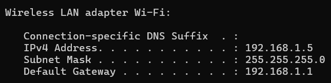<br>

Buka wireshark, kemudian start capture ke wifi.


Filter IP dengan mengetikkan "ip.addr == 192.168.1.5". Filter ini akan menghapus semua paket yang tidak berasal atau dituju ke host.
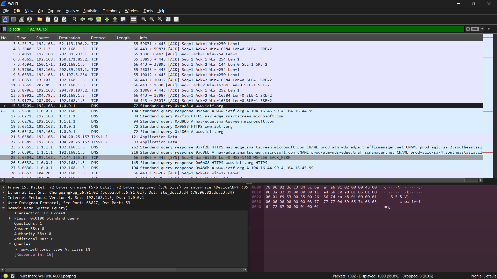<br>

Buka link ini https://www.ietf.org, setelah itu hentikan pengambilan paket.
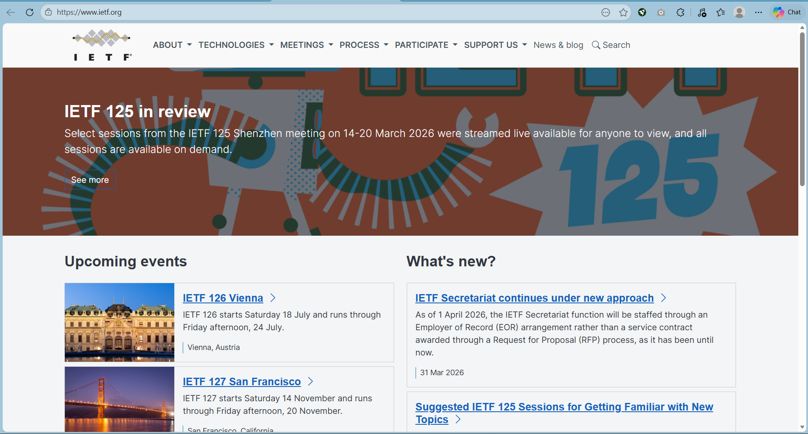<br>

Lalukan filter "ip.addr == 192.168.1.5 && dns.qry.name contains "ietf"".
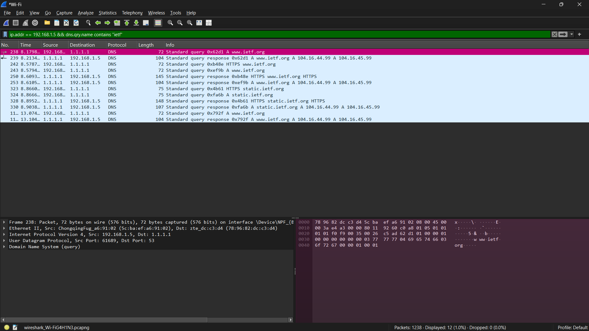<br>

<p>Jawab beberapa pertanyaan berikut: </p>
<ol>
    <li>Cari pesan permintaan DNS dan balasannya. Apakah pesan tersebut dikirimkan melalui UDP atau TCP?</li>
    <li>Apa port tujuan pada pesan permintaan DNS? Apa port sumber pada pesan balasannya?</li>
    <li>Pada pesan permintaan DNS, apa alamat IP tujuannya? Apa alamat IP server DNS lokal anda (gunakan ipconfig untuk mencari tahu)? Apakah kedua alamat IP tersebut sama?</li>
    <li>Periksa pesan permintaan DNS. Apa “jenis” atau ”type” dari pesan tersebut? Apakah pesan permintaan tersebut mengandung ”jawaban” atau ”answers”?</li> 
    <li>Periksa pesan balasan DNS. Berapa banyak ”jawaban” atau ”answers” yang terdapat di dalamnya? Apa saja isi yang terkandung dalam setiap jawaban tersebut?</li>
    <li>Perhatikan paket TCP SYN yang selanjutnya dikirimkan oleh host Anda. Apakah alamat IP pada paket tersebut sesuai dengan alamat IP yang tertera pada pesan balasan DNS?</li> 
    <li>Halaman web yang sebelumnya anda akses (http://www.ietf.org) memuat beberapa gambar.  Apakah host Anda perlu mengirimkan pesan permintaan DNS baru setiap kali ingin mengakses suatu gambar?</li>
</ol>

<p>Jawaban: </p>
<ol>
    <li>
        Pada permintaan DNS dan balasannya.
        <br>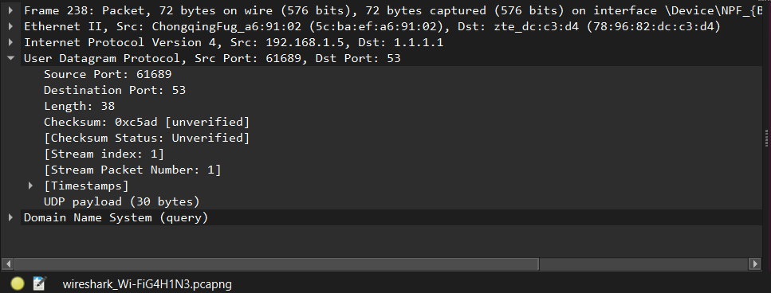<br>
        Sama-sama menggunakan UDP untuk permintaan maupun balasan.
    </li>
    <li>
        Port tujuan dan port sumber pada pesan permintaan DNS dan balasannya.
        <br><br>
        Port tujuannya (Destination Port) yaitu 53 dengan port sumbernya (Source Port) yaitu 61689 untuk permintaan dan sebaliknya untuk balasan.
    </li>
    <li>
        Alamat IP tujuan dari permintaan DNS dan amalat IP server DNS saya.
        <br><br></li>
        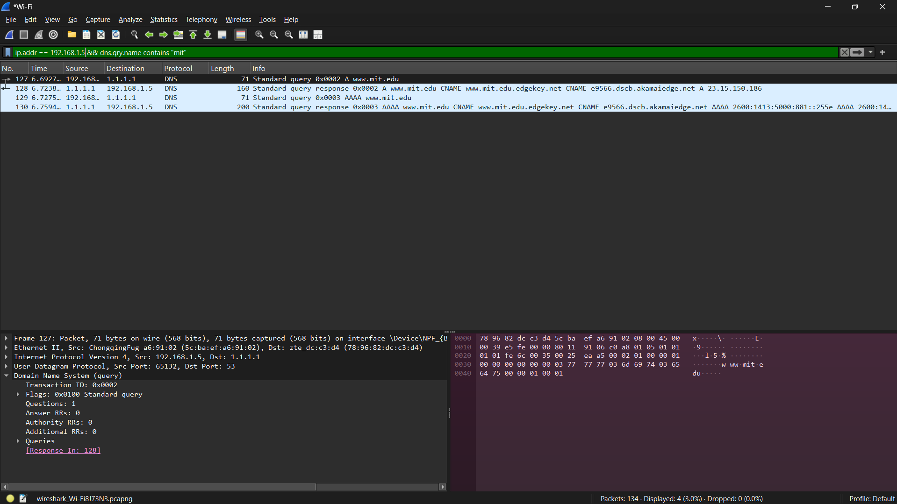<br>
        Pada hasil dari percobaan saya menggunakan IP yang sama yaitu 1.1.1.1 (server dari CLoudflare) yang berfungsi sebagai public recursive DNS resolver.
    <li>
        Memeriksa pesan permintaan DNS.
        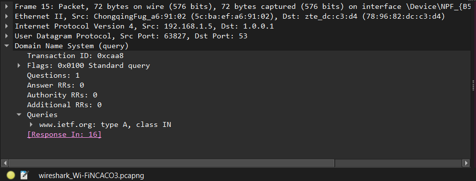<br>
        Pada gambar menunjukkan bahwa ini merupakan pesan permintaan DNS (Questions: 1) dengan query type A (jenis A).
    </li>
    <li>
        Memeriksa pesan balasan DNS.
        <br>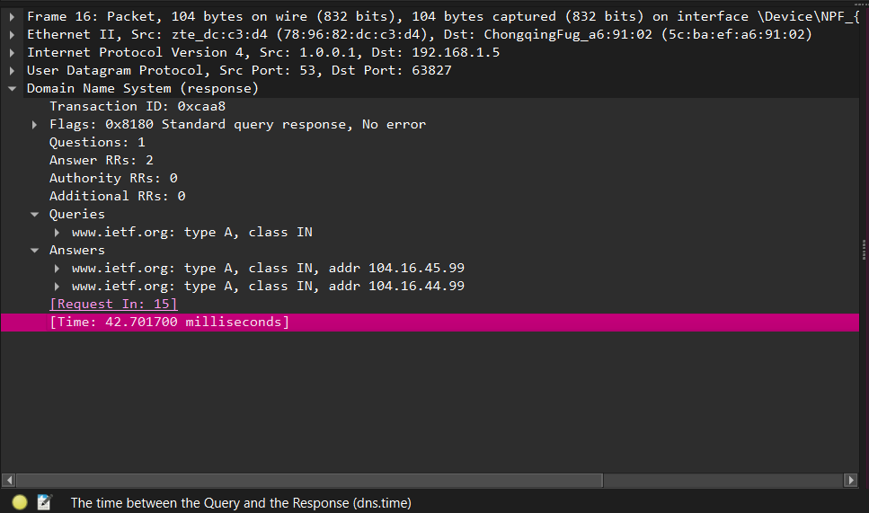<br>
        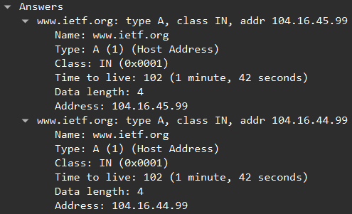<br>
        <p align="justify">
        Pada gambar menunjukkan bahwa ini merupakan pesan balasan DNS sebanyak 2 balasan (Answer RRs: 2 yang membalas Questions: 1) dengan query type A (jenis A) dari address 104.16.45.99 dan 104.16.44.99 yang berisi name, type, class, time to live, data length, dan address.
        </p>
    </li>
    <li>
        Mengecek kesesuaian IP pada paket TCP SYN yang dikirim oleh host saya.
        <br>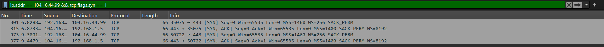<br>
        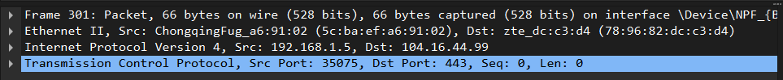<br>
        <p align="justify">
        Berdasarkan pada gambar IP host-nya sama yaitu 192.168.1.5, tetapi pada DNS server terdapat perbedaan karena pada balasan yaitu 1.0.0.1 dan pada paket SYN yaitu 104.16.44.99. Mengapa bisa DNS server berbeda? Karena pada host saya menggunakan DNS publik untuk membuka www.ietf.org yang artinya bisa dibuka secara publik tanpa harus melewati DNS server dari www.ietf.org.
        </p>
    </li>
    <li>
        Untuk web sebelumnya (www.ietf.org), apakah perlu mengirim permintaan DNS setiap kali ingin mengakses suatu gambar?
        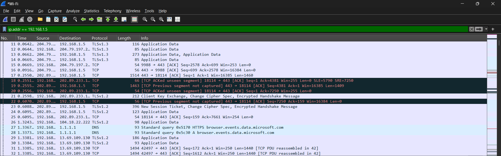<br>
        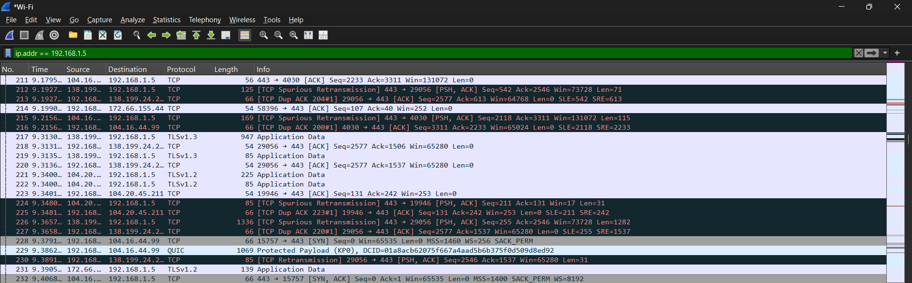<br>
        <p align="justify">
         Tidak perlu mengirim permintaan DNS baru untuk setiap gambar selama semua gambar yang diambil dari hostname yang sama dan jawaban DNS masih tersimpan di cache, tetapi jika gambar berasal dari hostname yang berbeda, cache sudah kedaluwarsa, atau ada redirect, maka akan ada query DNS terpisah.
        </p>
    </li>
</ol>

##### Mulai pengambilan paket
Lakukan perintah:
```
nslookup www.mit.edu
``` 

<p>Jawablah pertanyaan berikut:</p>

<ol>
    <li>Apa port tujuan pada pesan permintaan DNS? Apa port sumber pada pesan balasan DNS?</li> 
    <li>Ke alamat IP manakah pesan permintaan DNS dikirimkan? Apakah alamat IP tersebut merupakan default alamat IP server DNS lokal Anda? 
    <li>Periksa pesan permintaan DNS. Apa ”jenis” atau ”type” dari pesan tersebut? Apakah pesan tersebut mengandung ”jawaban” atau ”answers”?</li> 
    <li>Periksa pesan balasan DNS. Berapa banyak ”jawaban” atau “answers” yang terdapat di dalamnya. Apa saja isi yang terkandung dalam setiap jawaban tersebut?</li>
</ol>

<p>Jawaban: </p>
<ol>
    <li>
        Port tujuan pada pesan permintaan DNS dan port sumber pada pesan balasan DNS.<br>
        (Pesan permintaan DNS)
        <br>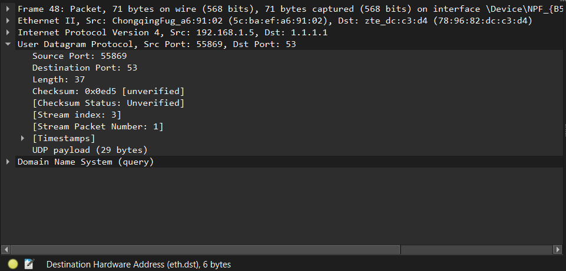<br>
        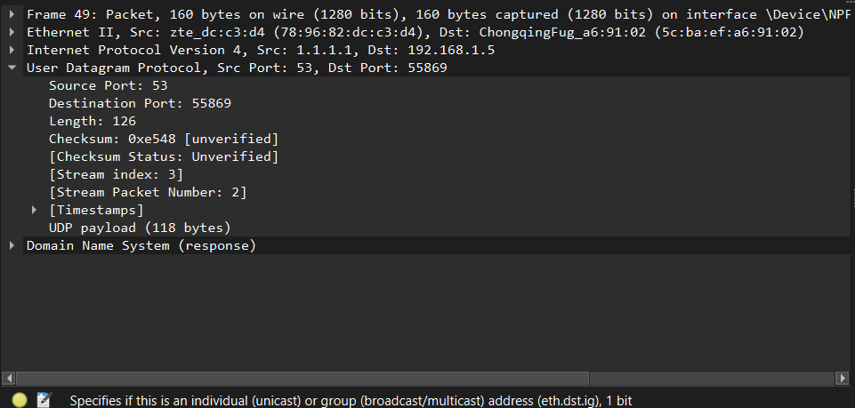<br>
        Dari gambar bisa dilihat untuk port tujuan pada pesan DNS adalah 53 dam untuk port sumber pada pesan balasan DNS adalah 53.
    </li>
    <li>
        Alamat IP pesan permintaan DNS dikirimkan.
        <br><br>
        Pesan permintaan DNS dikirimkan ke alamat IP 1.1.1.1 sebagai default DNS pada laptop saya.
    </li>
    <li>
        Memeriksa pesan permintaan DNS.
        <br>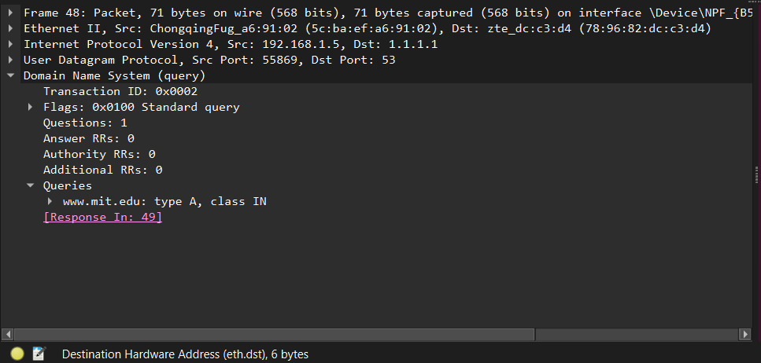<br>
        Pada pesan permintaan DNS dengan type A (jenis A) yang tidak mengandung jawaban atau answers (Questions: 1, Answer RRs: 0).
    </li>
    <li>
        Memeriksa pesan balasan DNS.
        <br>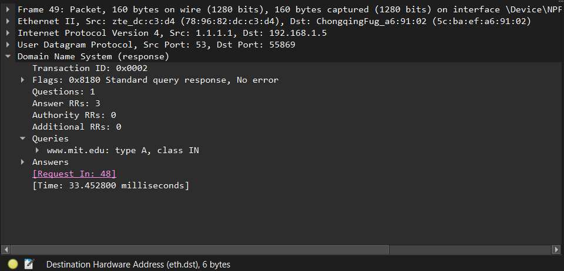<br>
        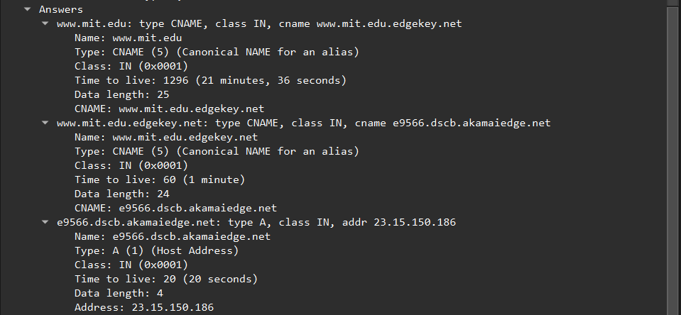<br>
        Pada pesan balasan DNS terdapat 3 jawaban atau answers (Answer RRs: 3) yang berisikan name, type, class, time to live, data length, CNAME, dan address.
    </li>
</ol>

<p>Sekarang, ulangi percobaan sebelumnya, namun gunakan perintah: </p>  

```
nslookup –type=NS mit.edu
```

Jawablah pertanyaan berikut:
1. Ke alamat IP manakah pesan permintaan DNS dikirimkan? Apakah alamat IP tersebut 
merupakan default alamat IP server DNS lokal Anda? 
2. Periksa pesan permintaan DNS. Apa ”jenis” atau ”type” dari pesan tersebut? Apakah pesan tersebut mengandung ”jawaban” atau ”answers”? 
3. Periksa pesan balasan DNS. Apa nama server MIT yang diberikan oleh pesan balasan? 
Apakah pesan balasan ini juga memberikan alamat IP untuk server MIT tersebut? 

Jawaban:
<ol>
    <li>
        Alamat IP pesan permintaan DNS dikirimkan.
        <br>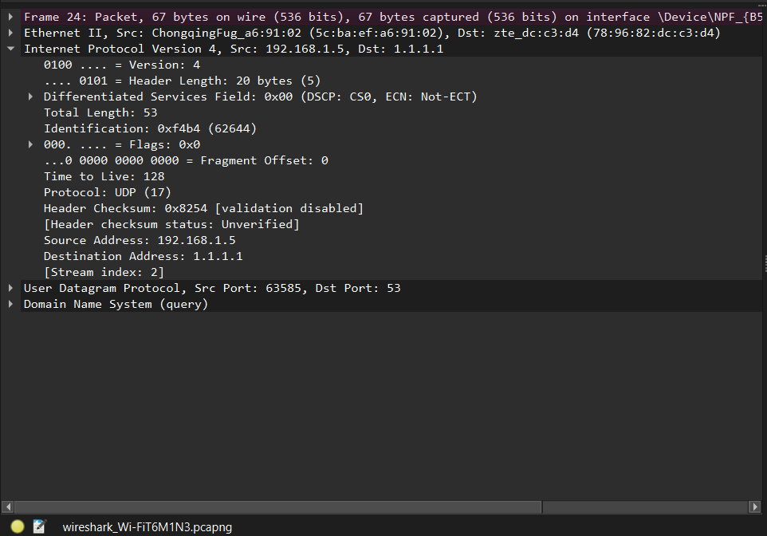<br>
        Pada gamabar bisa dilihat alamat tujuannya yaitu 1.1.1.1 (cloudflare) yang menjadi default pada laptop saya.
    </li>
    <li>
        Memeriksa pesan permintaan DNS.
        <br>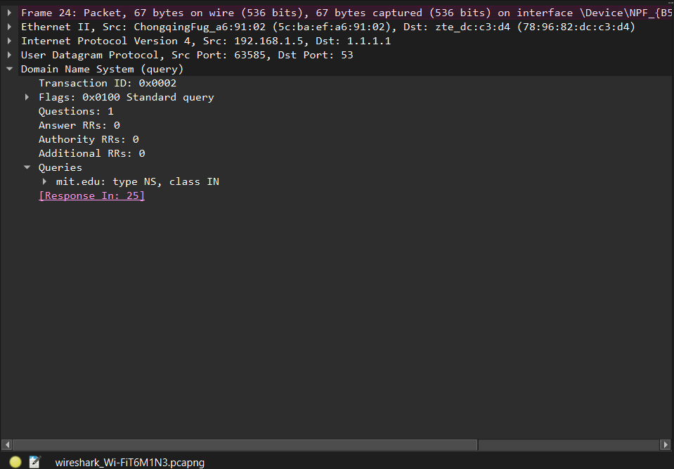<br>
        Pada pesan permintaan DNS dengan type NS (jenis NS) yang tidak mengandung jawaban atau answers (Questions: 1, Answer RRs: 0).
    </li>
    <li>
        Memeriksa pesan balasan DNS.
        <br>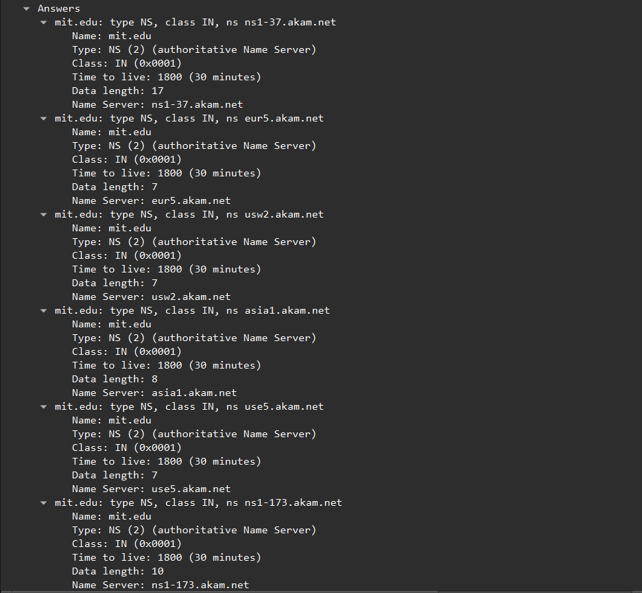<br>
        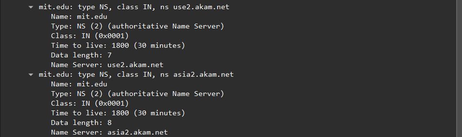<br>
        Dari pesan balasan DNS dapat dilihat bahwa balasan tidak memberikan IP address melainkan nama servernya.
    </li>
</ol>

<p>Sekarang, ulangi percobaan sebelumnya, namun gunakan perintah: </p>   

```
nslookup www.aiit.or.kr bitsy.mit.edu
```

<p>Jawablah pertanyaan berikut:  </p>
<ol>
    <li>Ke alamat IP manakah pesan permintaan DNS dikirimkan? Apakah alamat IP tersebut merupakan default alamat IP server DNS lokal Anda?</li>
    <li>Periksa pesan permintaan DNS. Apa ”jenis” atau ”type” dari pesan tersebut? Apakah pesan tersebut mengandung ”jawaban” atau ”answers”?</li> 
    <li>Periksa pesan balasan DNS. Berapa banyak ”jawaban” atau “answers” yang terdapat di dalamnya. Apa saja isi yang terkandung dalam setiap jawaban tersebut?</li>
</ol>

<p>Jawaban: </p>
<ol>
    <li>
        Alamat IP pesan permintaan DNS dikirimkan.
        <br>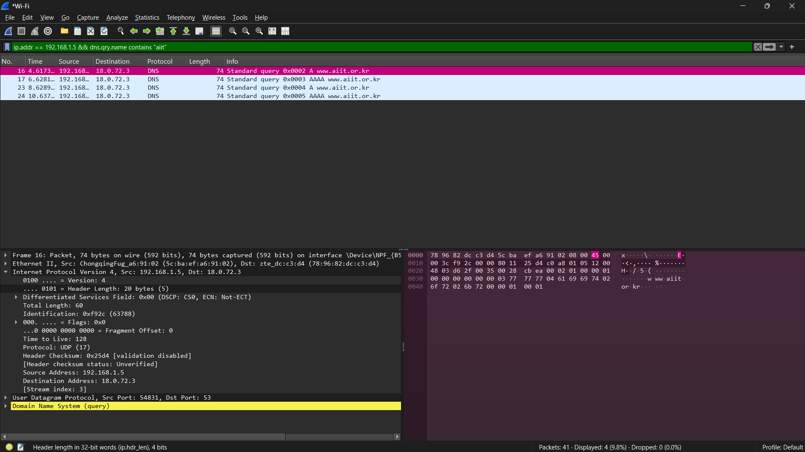<br>
        Alamat IP pesan permintaan DNS dikirimkan ke DNS server milik bitsy.mit.edu yaitu "18.0.72.3".
    </li>
    <li>
        Memeriksa pesan permintaan DNS.
        <br>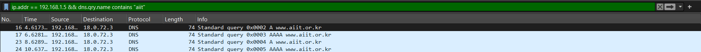<br>
        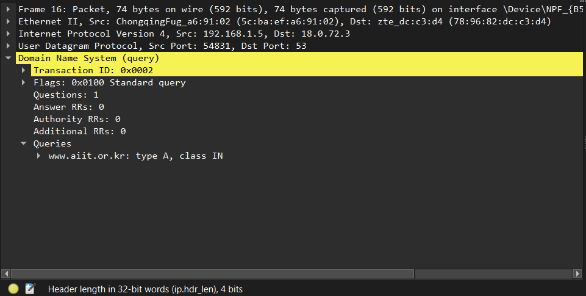<br>
        Pada pesan permintaan DNS dengan type A dan type AAAA tanpa ada jawaban atau answers.
    </li>
    <li>
        Memeriksa pesan balasan DNS.
        <br><br>
        <br>
        <p align="justify">
        Bisa dilihat saat difilter tidak ada satupun yang bertuliskan "response" yang artinya server otoritatif www.aiit.or.kr tidak dapat dijangkau (dalam waktu yang ditentukan) oleh bitsy.mit.edu yang akhirnya menyebabkan RTO (Retransmission Timeout).
        </p>
    </li>
</ol>

## UDP (modul 5)
<p align="justify">
UDP (User Datagram Protocol) adalah protokol lapisan transport TCP/IP yang ringan, tanpa koneksi, dan tidak andal. UDP mengirimkan data sebagai datagram secara langsung tanpa melakukan negosiasi koneksi (handshake).
</p>

<p align="justify">
Gunakan link ini http://gaia.cs.umass.edu/wireshark-labs/wireshark-traces.zip (dalam bentuk zip) dengan membuka file bernama <kbd>http-ethereal-trace-5</kbd> di wireshark untuk mengerjakan pertanyaan dibawah ini.</p>

<p>Jawablah beberapa pertanyaan berikut.</p>
<ol>    
    <li>Pilih satu paket UDP yang terdapat pada trace Anda. Dari paket tersebut, berapa banyak “field” yang terdapat pada header UDP? Sebutkan nama-nama field yang Anda temukan!</li>
    <li>Perhatikan informasi “content field” pada paket yang Anda pilih di pertanyaan 1. Berapa panjang (dalam satuan byte) masing-masing “field” yang terdapat pada header UDP?</li> 
    <li>Nilai yang tertera pada ”Length” menyatakan nilai apa? Verfikasi jawaban Anda melalui paket UDP pada trace.</li> 
    <li>Berapa jumlah maksimum byte yang dapat disertakan dalam payload UDP? (Petunjuk: jawaban untuk pertanyaan ini dapat ditentukan dari jawaban Anda untuk pertanyaan 2)</li>
    <li>Berapa nomor port terbesar yang dapat menjadi port sumber? (Petunjuk: lihat petunjuk pada pertanyaan 4)</li> 
    <li>Berapa nomor protokol untuk UDP? Berikan jawaban Anda dalam notasi heksadesimal dan desimal. Untuk menjawab pertanyaan ini, Anda harus melihat ke bagian ”Protocol” pada datagram IP yang mengandung segmen UDP.</li>
    <li>Periksa pasangan paket UDP di mana host Anda mengirimkan paket UDP pertama dan paket UDP kedua merupakan balasan dari paket UDP yang pertama. (Petunjuk: agar paket kedua merupakan balasan dari paket pertama, pengirim paket pertama harus menjadi tujuan dari paket kedua). Jelaskan hubungan antara nomor port pada kedua paket tersebut!</li>
</ol>

<p>Jawaban: </p>
<ol>
    <li>
        Banyak field pada header UDP dan nama-nama field.
        <br>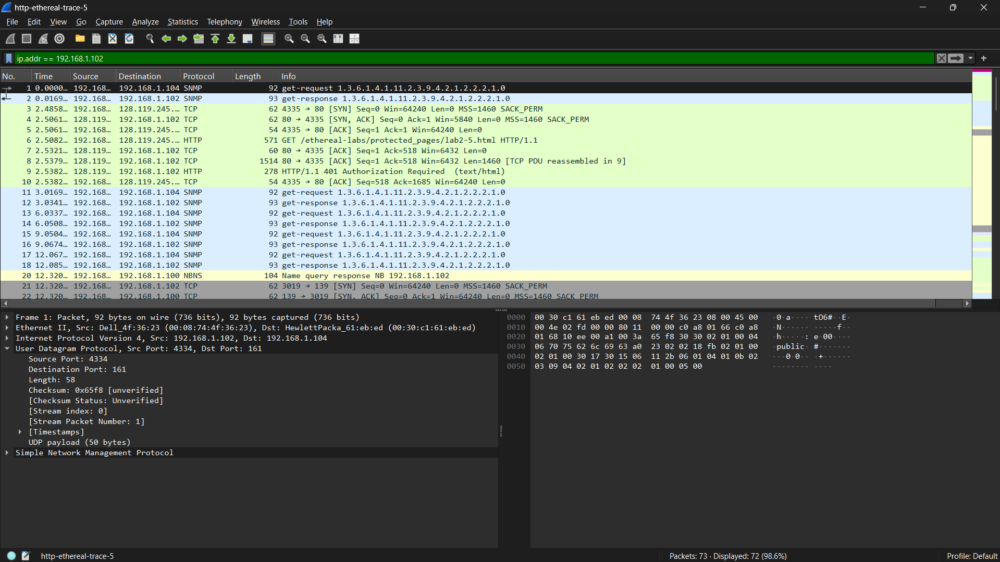<br>
        Pada gambar terdapat 4 field yaitu source port (4334), destination port (101), length (58), dan checksum (0x65f8).
    </li>
    <li>
        Informasi pada content field (panjang satuan dalam byte) pada header UDP.
        <br>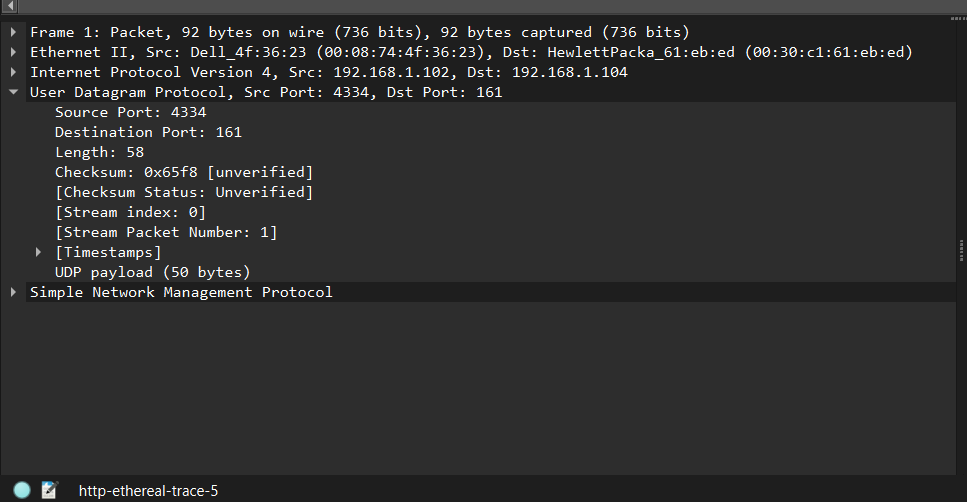<br>
        Ukuran pada tiap content field adalah 2 byte. Kenapa 2 byte? Karena dalam satu Header UDP punya total 8 byte (ukuran tetap).
    </li>
    <li>
        Nilai length pada paket UDP yaitu 58 yang didapat dari menjumlahkan nilai UDP payload (50 byte) dengan Header UDP (8 byte).
    </li>
    <li>
        <p align="justify">
        Jumlah maksimum byte dalam payload UDP adalah 65527 byte. Dari mana hasil tersebut didapat? Hasil didapat dari jumlah maksimum length dikurangi dengan payload. Karena tiap field pada header UDP punya total panjang 16 bit, nilai dari jumlah maksimum length = 2<sup>16</sup> &minus; 1 = 65536 &minus; 1 = 65535. Kemudian kurangi dengan nilai dari header UDP, jumlah maksimum payload UDP = 65535 &minus; 8 = 65527.
        </p> 
    </li>
    <li>
        Nomor port terbesar yang menjadi port sumber adalah 65535 (2<sup>16</sup> &minus; 1), karena tiap field pada header UDP punya total panjang 16 bit.
    </li>
    <li>
        Nomor protokol untuk UDP.
        <br>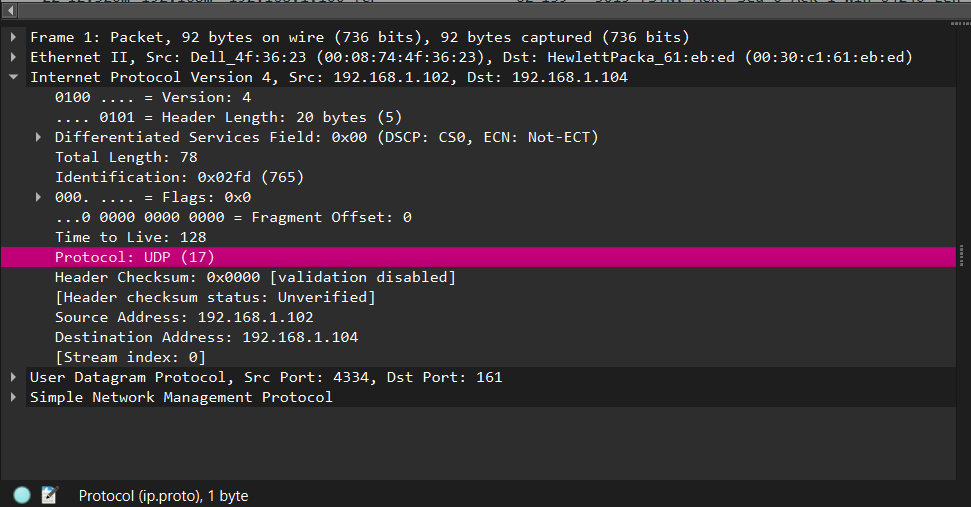<br>
        Pada gambar nomor protokol untuk UDP adalah 17 (Protocol: UDP (17)).
    </li>
    <li>
        Hubungan paket mengirim dan paket balasan pada UDP tersebut.
        <br>
        <br>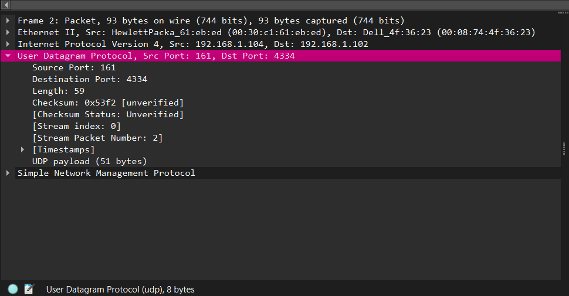<br>
        <p align="justify">
        Pada paket UDP pertama terdapat port sumber yaitu 4334 (ephemeral atau acak) dan port tujuan yaitu 161 yang bertindak sebagai klien. Sedangkan pada paket UDP kedua terdapat port sumber yaitu 161 dan port tujuan yaitu 4334 yang bertindak sebagai server. Hubungan kedua saling berkait karena paket satu terhubung dengan paket dua sebagai pengirim dan paket dua terhubung dengan paket satu sebagai penerima.
        </p>
    </li>
</ol>