# Laporan Praktikum Week 4

<pre>
Nama        : Ivan Radithya Tanaya Ardianto
NIM         : 103072430005
Kelas       : IF-04-05
Mata Kuliah : Jaringan Komputer
</pre>
__________________________________________

 

## TCP (modul 6)

TCP (Transmission Control Protocol) adalah protokol utama dalam jaringan komputer yang berfungsi untuk mengatur pengiriman data yang andal, berorientasi koneksi, dan terurut dari sumber ke tujuan. TCP memecahkan data menjadi paket kecil, memastikan data terkirim tanpa kesalahan, dan mengelola aliran data agar tidak terjadi penumpukan.

### Menangkap Transfer TCP dalam Jumlah Besar dari Komputer Pribadi ke Remote Server
<ul>
    <li>
    Pertama buka link ini <a href="http://gaia.cs.umass.edu/wireshark-labs/alice.txt" target="_blank">http://gaia.cs.umass.edu/wireshark-labs/alice.txt</a>, lalu tekan Ctrl + S atau klik kanan kemudian pilih Save as.
    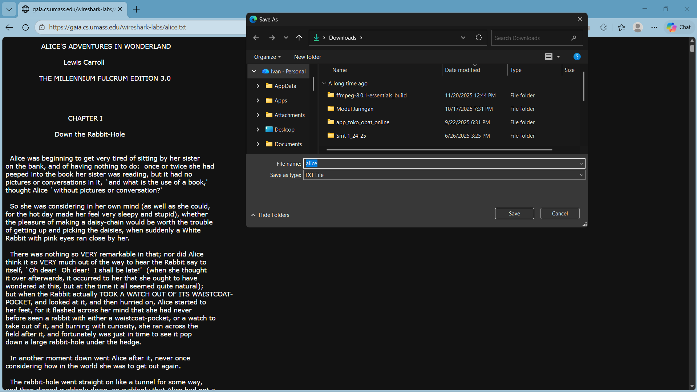 
    </li>
    <li>
    Selanjutnya klik link ini <a href="http://gaia.cs.umass.edu/wireshark-labs/TCP-wireshark-file1.html" target="_blank">http://gaia.cs.umass.edu/wireshark-labs/TCP-wireshark-file1.html</a>, buka wireshark lalu start capture ke wifi, lalu upload alice.txt file.
    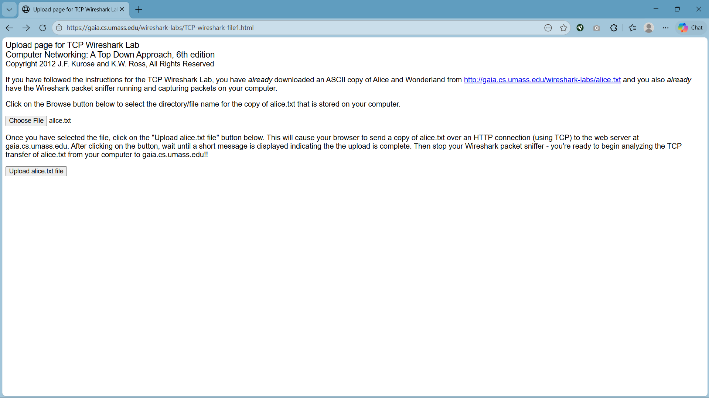 
    </li>
    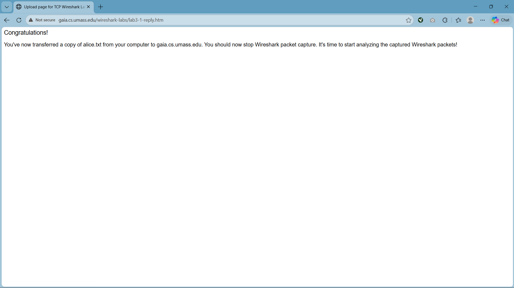 
    Setelah upload akan keluar tulisan seperti pada gambar.
    </li>
    <li>
    Hentikan capture, lalu lakukan filter dengan mengetikkan tcp.
    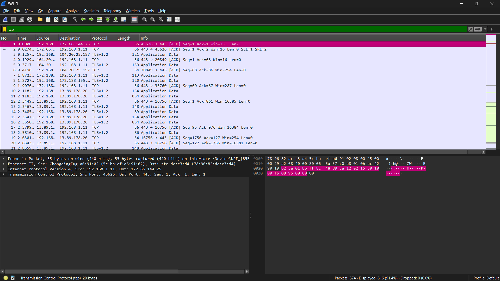 
    Lalu lakukan filter dengan filter <kbd>tcp.flags.syn == 1</kbd> atau bisa scroll sampai ketemu tulisan <kbd>[SYN]</kbd>.
    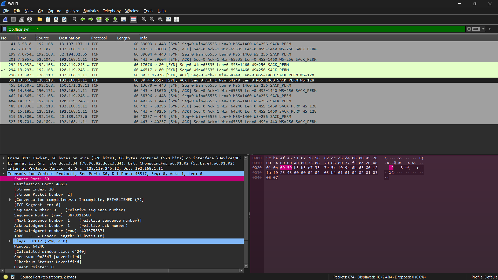 
    

    Paket SYN berfungsi untuk memulai koneksi antara klien dan server (proses three-way handshake (SYN &rarr; SYN-ACK &rarr; ACK)). Paket SYN mengandung Initial Sequence Number (ISN) yang berfungsi untuk menandai awal urutan data, sehingga komunikasi berjalan secara reliabel (dua arah). Tanpa adanya paket SYN, koneksi TCP tidak akan terbentuk.
    

    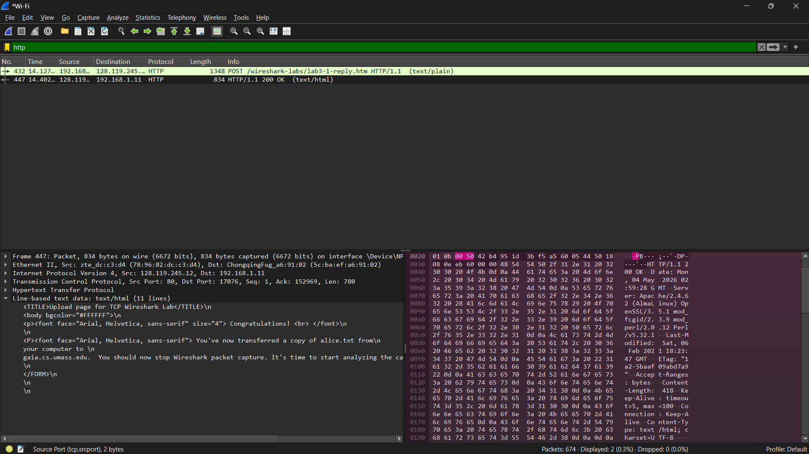 
    Setelah itu, server akan memberikan respon berupa  HTTP/1.1 200 OK sebagai respon permintaan berhasil di proses yang kemudian mengirimkan hasil berupa file.
    </li>
</ul>

### Tampilan Awal pada Captured Trace
Jawablah pertanyaan-pertanyaan berikut dengan menganalisis paket yang tertangkap.
<ol>
    <li>
        

        Berapa alamat IP dan nomor port TCP yang digunakan oleh komputer klien (sumber) untuk mentransfer file ke gaia.cs.umass.edu? Cara paling mudah menjawab pertanyaan ini adalah dengan memilih sebuah pesan HTTP dan meneliti detail paket TCP yang digunakan untuk membawa pesan HTTP tersebut.
        

    </li>
    <li>
    Apa alamat IP dari gaia.cs.umass.edu? Pada nomor port berapa ia mengirim dan menerima segmen TCP untuk koneksi ini?
    </li>
    <li>
    Berapa alamat IP dan nomor port TCP yang digunakan oleh komputer klien Anda (sumber) untuk mentransfer ke gaia.cs.umass.edu?
    </li>
</ol>

Jawaban:
1. Alamat IP pada klien dan portnya untuk transfer file.
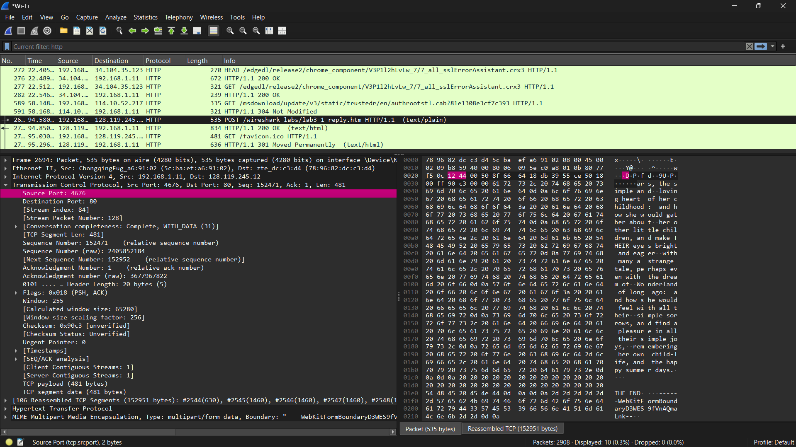
Untuk alamat IP-nya yaitu 192.168.1.11 dan portnya yaitu 4676.
2. ALamat IP pada klien dan portnya untuk mengirim dan menerima file.
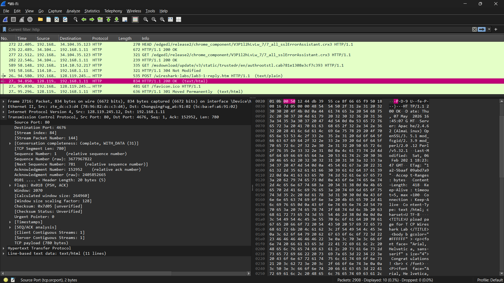
Untuk alamat IP-nya yaitu 128.119.245.12 dan portnya yaitu 80.
3. Alamat IP pada klien (PC atau laptop saya) dan portnya untuk transfer file.
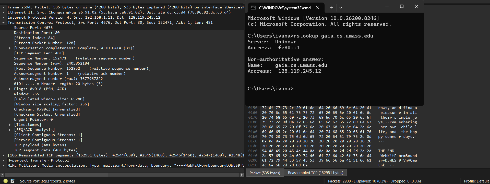
Untuk alamat Ip-nya yaitu fe80::1 (local address) dan portnya yaitu 4676.

### Dasar TCP

Gunakan trace paket yang telah Anda tangkap (dan/atau jejak paket <kbd>tcp-ethereal-trace-1</kbd> di <a href=http://gaia.cs.umass.edu/wireshark-labs/wireshark-traces.zip>http://gaia.cs.umass.edu/wireshark-labs/wireshark-traces.zip</a> untuk mempelajari sifat TCP.

Jawablah beberapa pertanyaan berikut untuk segmen TCP:
<ol>
    <li>
        

        Berapa nomor urut segmen TCP SYN yang digunakan untuk memulai sambungan TCP antara komputer klien dan gaia.cs.umass.edu? Apa yang dimiliki segmen tersebut sehingga teridentifikasi sebagai segmen SYN?
        

    </li>
    <li>
        

        Berapa nomor urut segmen SYNACK yang dikirim oleh gaia.cs.umass.edu ke komputer klien sebagai balasan dari SYN? Berapa nilai dari field Acknowledgement pada segmen SYNACK? Bagaimana gaia.cs.umass.edu menentukan nilai tersebut? Apa yang dimiliki oleh segmen sehingga teridentifikasi sebagai segmen SYNACK?
        

    </li>
    <li>
        

        Berapa nomor urut segmen TCP yang berisi perintah HTTP POST? Perhatikan bahwa untuk menemukan perintah POST, Anda harus menelusuri content field milik paket di bagian bawah jendela Wireshark, kemudian cari segmen yang berisi "POST" di bagian field DATA-nya.
        

    </li>
    <li>
        

        Anggap segmen TCP yang berisi HTTP POST sebagai segmen pertama dalam koneksi TCP. Berapa nomor urut dari enam segmen pertama dalam TCP (termasuk segmen yang berisi HTTP POST)? Pada jam berapa setiap segmen dikirim? Kapan ACK untuk setiap segmen diterima? Dengan adanya perbedaan antara kapan setiap segmen TCP dikirim dan kapan acknowledgement-nya diterima, berapakah nilai RTT untuk keenam segmen tersebut? Berapa nilai EstimatedRTT setelah penerimaan setiap ACK? (Catatan: Wireshark memiliki fitur yang memungkinkan Anda untuk memplot RTT untuk setiap segmen TCP yang dikirim. Pilih segmen TCP yang dikirim dari klien ke server gaia.cs.umass.edu pada jendela "daftar paket yang ditangkap". Kemudian pilih: Statistics &rarr; TCP Stream Graph &rarr; Round Trip Time Graph).
        

    </li>
    <li>
        

        Berapa panjang setiap enam segmen TCP pertama?
        

    </li>
    <li>
        

        Berapa jumlah minimum ruang buffer tersedia yang disarankan kepada penerima dan diterima untuk seluruh trace? Apakah kurangnya ruang buffer penerima pernah menghambat pengiriman?
        

    </li>
    <li>
        

        Apakah ada segmen yang ditransmisikan ulang dalam file trace? Apa yang anda periksa (di dalam file trace) untuk menjawab pertanyaan ini?
        

    </li>
    <li>
        

        Berapa banyak data yang biasanya diakui oleh penerima dalam ACK? Dapatkah anda mengidentifikasi kasus-kasus di mana penerima melakukan ACK untuk setiap segmen yang diterima?
        

    </li>
    <li>
        

        Berapa throughput (byte yang ditransfer per satuan waktu) untuk sambungan TCP? Jelaskan bagaimana Anda menghitung nilai ini.
        

    </li>
</ol>

Jawaban:
<ol>
    <li>
        

        Nomor urut segmen TCP SYN yang digunakan untuk memulai sambungan TCP antara komputer klien dan gaia.cs.umass.edu.
        

        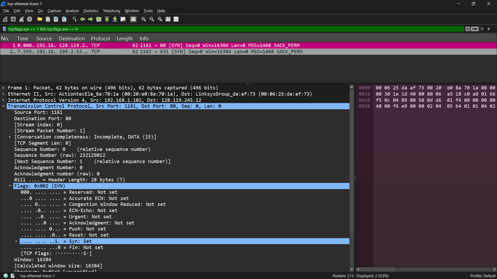
        

        Dengan filter <kbd>tcp.flags.syn == 1 && tcp.flags.ack == 0</kbd> dengan sequence number = 0 (posisi byte pertama dalam aliran data TCP) yang artinya koneksi atau sambungan terjadi dan melakukan three-way handshake.
        

    </li>
    <li>
        

        Nomor urut segmen SYNACK yang dikirim oleh gaia.cs.umass.edu ke komputer klien sebagai balasan dari SYN.
        

        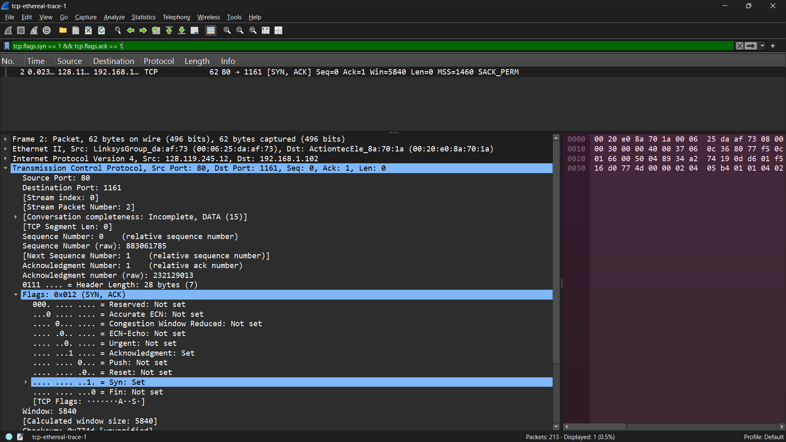 
        

        Dengan filter <kbd>tcp.flags.syn == 1 && tcp.flags.ack == 0</kbd> dengan sequence number = 0 untuk SYN-ACK (server &rarr; klien) dan sequence number = 1 untuk ACK (klien &rarr; server).
        

    </li>
    <li>
        
Nomor urut segmen TCP yang berisi perintah HTTP POST.

        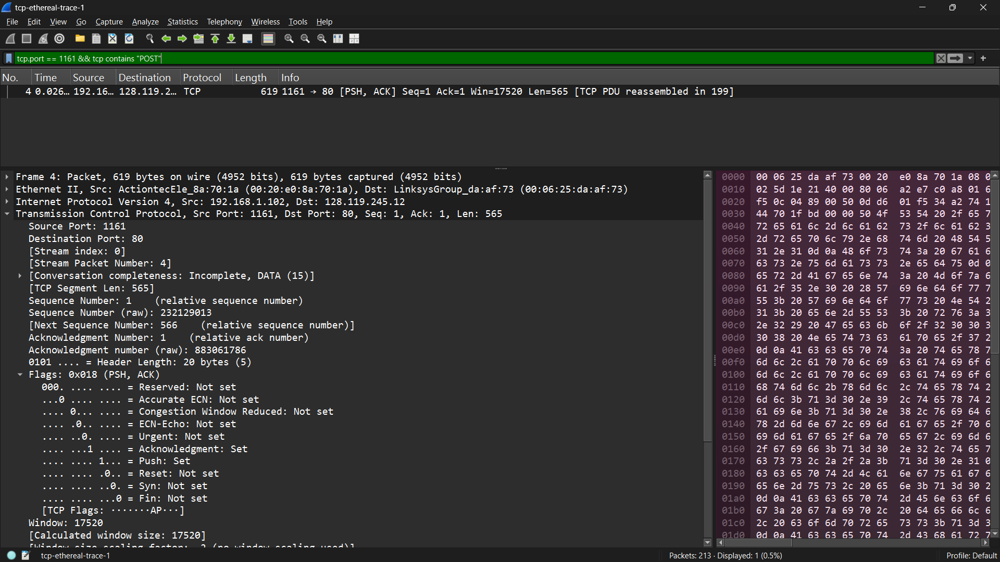
        

        Dengan filter <kbd>tcp.port == 1161 && tcp contains "POST"</kbd> dengan sequence number = 1 untuk segmen pada HTTP POST.
        

    </li>
    <li>
        
Nomor urut dari enam segmen pertama dalam TCP untuk HTTP POST.

        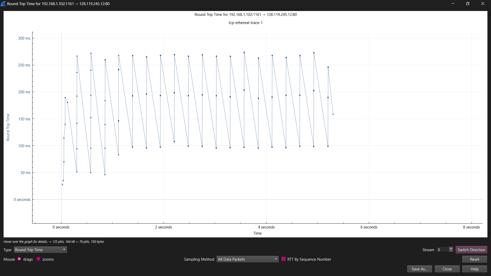
        

        Nomor urut untuk TCP sendiri ditentukan oleh sequence number-nya. Kalau untuk enam segmen pertama (termasuk HTTP POST), RTT yang terukur bervariasi kalau untuk yang digambar ada diantara 90-300 ms, dengan rata-rata sekitar 300 ms. Nilai estimasinya RTT setelah setiap ACK tetap stabil di kisaran 250-300 ms.
        

    </li>
    <li>
        
Panjang setiap enam segmen TCP pertama.

        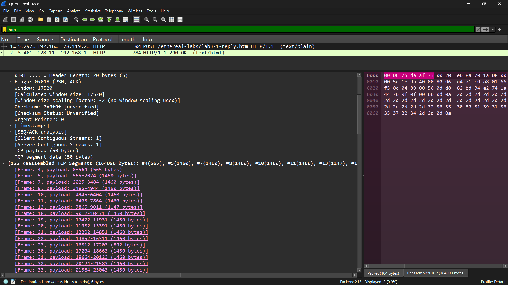
        

        Panjang untuk setiap enam segmen TCP pertama yaitu 565 byte untuk segmen pertama dan 1460 byte per-segmen berikutnya (pada enam segmen pertama). Dengan total data sebesar 7865 byte.
        

    </li>
    <li>
        
Jumlah minimum ruang buffer yang tersedia.

        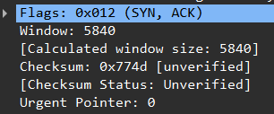 
        

        Untuk mengetahui jumlah minimum yang dibutuhkan bisa dicek dengan filter <kbd>tcp.flags.syn == 1 && tcp.flags.ack == 1</kbd> dengan window = 5840. Kenapa SYN-ACK menjadi parameter untuk minimum window? Itu karena pertama kali koneksi terbentuk minimum window ada sebagai awal negosisasi atau kesepatan kapasitas buffer. Jika window = 0 (zero window), maka pengirimkan paket sempat tertahan. Cara mengeceknya dengan filter <kbd>tcp.analysis.window_update</kbd>, seperti pada gambar dibawah
        

        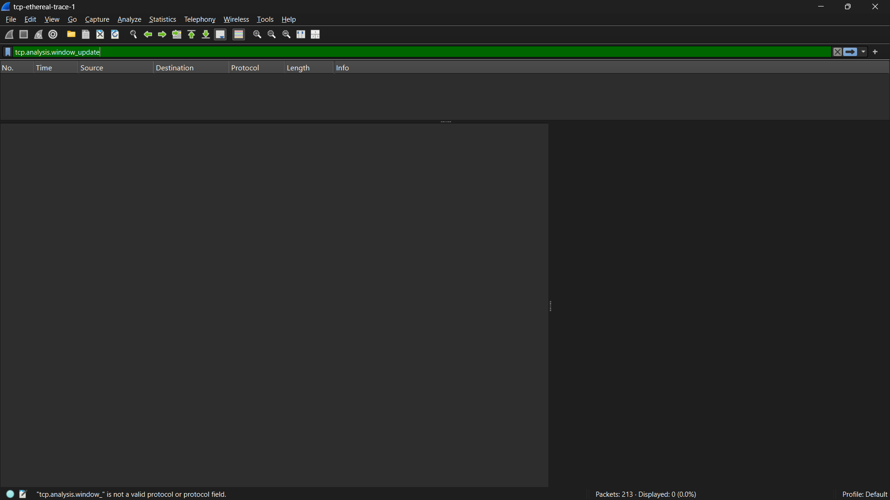
        

        Karena tidak ada zero window, berarti buffer penerima selalu punya ruang dan pengririman tidak harus menunggu ruang buffer (buffer tidak penuh).
        

    </li>
    <li>
        
Segmen transmisi ulang dalam file trace.

        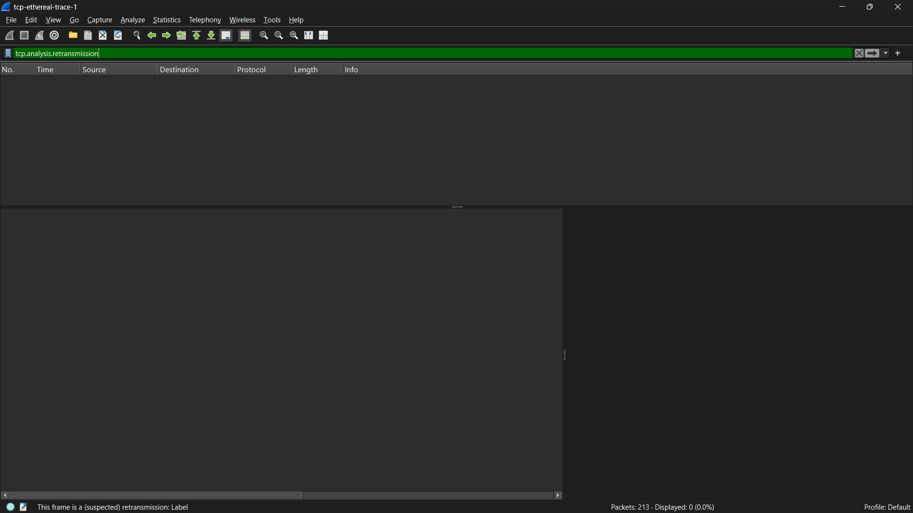
        

        Dengan filter <kbd>tcp.analysis.retransmission</kbd> dengan menggunakan filter ini, bisa diketahui bahwa apakah ada paket yang dikirim ulang atau tidak. Tapi kerena kosong, arti paket berhasil dikirim tanpa perlu dikirim ulang.
        

    </li>
    <li>
        

        Banyak data yang diakui oleh penerima dalam ACK.
        

        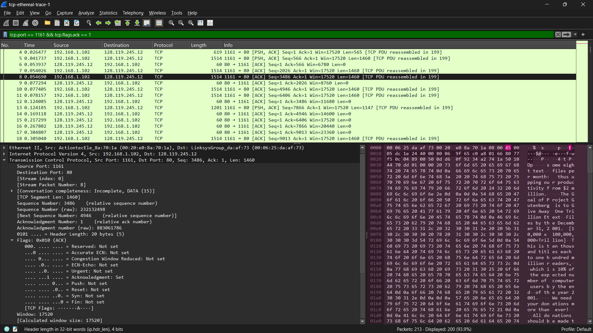
        

        Dengan filter <kbd>tcp.port == 1161 && tcp.flags.ack == 1</kbd> bisa melihat banyak data yang diakui oleh penerima dalam ACK. Untuk kasusnya sequence number dimulai dari 1, kemudian akan bertambah berdasarkan data dari segmen tersebut. Untuk segmen pertama yaitu 565 byte yang artinya sequence numbernya yaitu 566. untuk segmen berikutnya yaitu 1460 byte yang artinya sequence numbernya yaitu 2026. Yang pasti akan bertambah terus sampai sesuai total data yang diterima.
        
 
    </li>
    <li>
        
Throughput untuk sambungan TCP.

        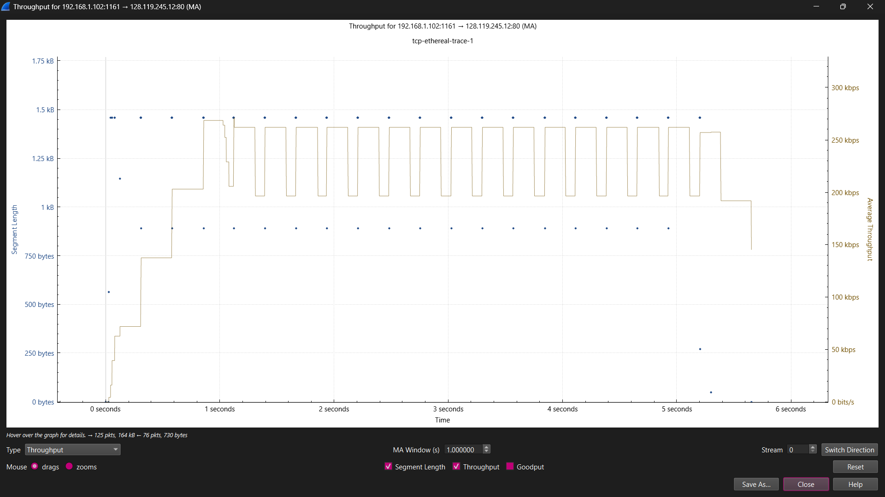
        

        Berdasarkan pada gambar fluktuasi berada diantara 150-280 kbps untuk average throughputnya.
        

    </li>
</ol>

### Congestion Control pada TCP

Gunakan alat plotting Time-Sequence-Graph (Stevens) untuk melihat grafik nomor urut berbanding waktu dari segmen yang dikirim oleh klien ke server gaia.cs.umass.edu. Dapatkah Anda mengidentifikasi di mana fase “slow start” TCP dimulai dan berakhir, dan pada bagian mana algoritma ”congestion avoidance” mengambil alih? Berikan komentar tentang bagaimana data yang diukur berbeda dari perilaku ideal TCP yang telah kita pelajari. (dengan menggunakan <kbd>tcp-ethereal-trace-1</kbd>)

Jawaban:

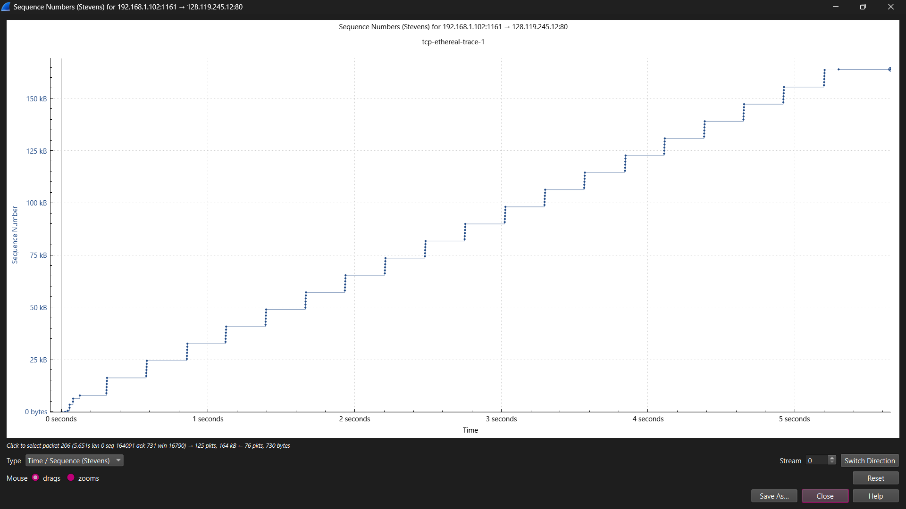
Pada <kbd>tcp-ethereal-trace-1</kbd> slow start diawal koneksi dan berakhir sekitar 1-2 detik, lalu congestion avoidance (mekanisme kontrol kemacetan TCP) mengambil alih dengan pertumbuhan linier.

Jawablah kedua pertanyaan di atas untuk trace yang Anda dapatkan ketika Anda mengirimkan file dari komputer ke gaia.cs.umass.edu.

Jawaban:

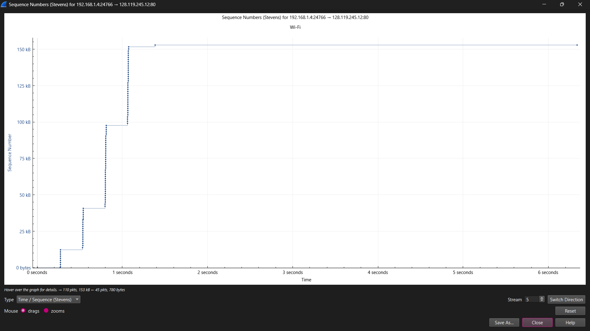
Pada <kbd>Wi-Fi</kbd> pola lebih fluktuatif, slow start terganggu, dan congestion avoidance muncul lebih cepat.

