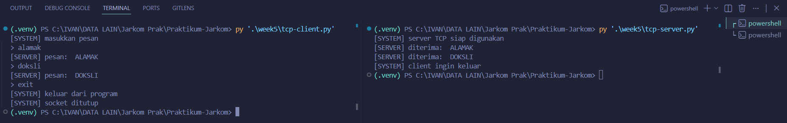
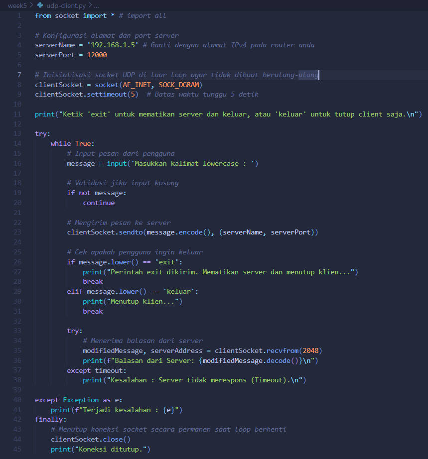
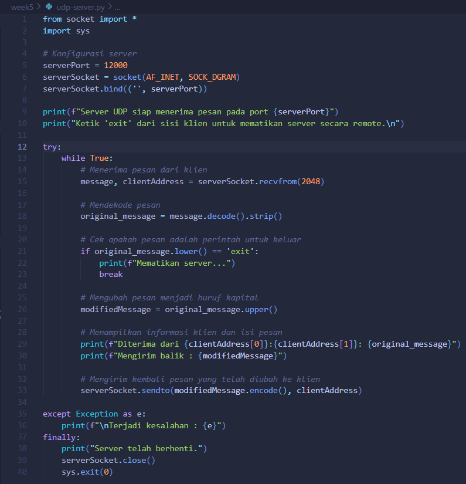
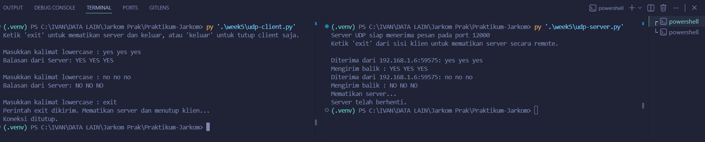
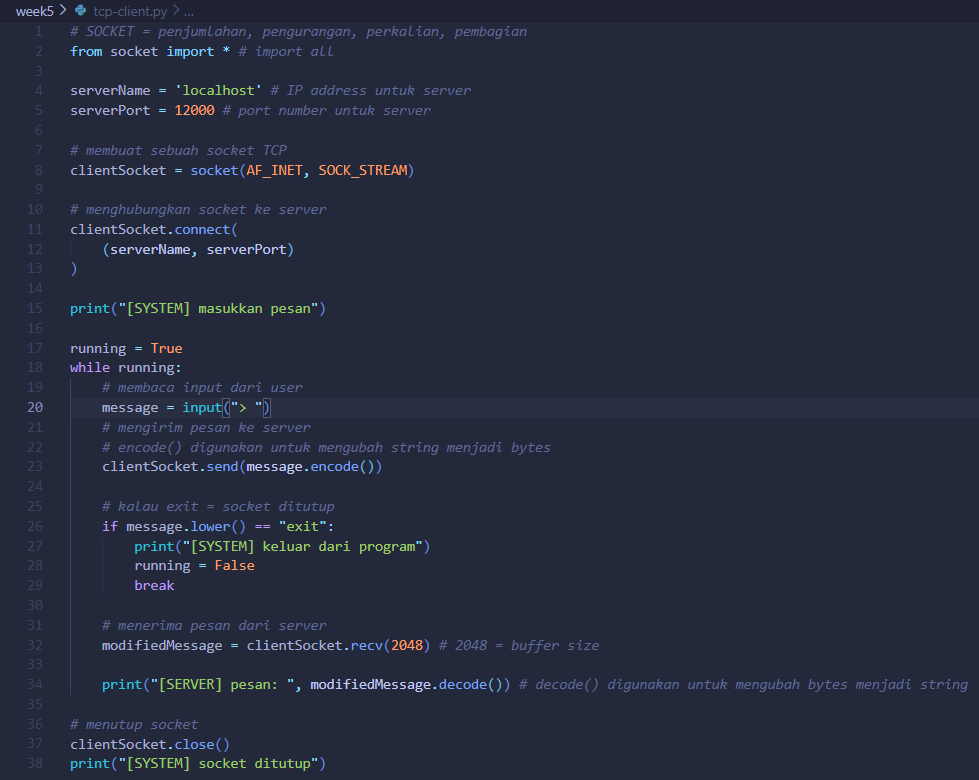
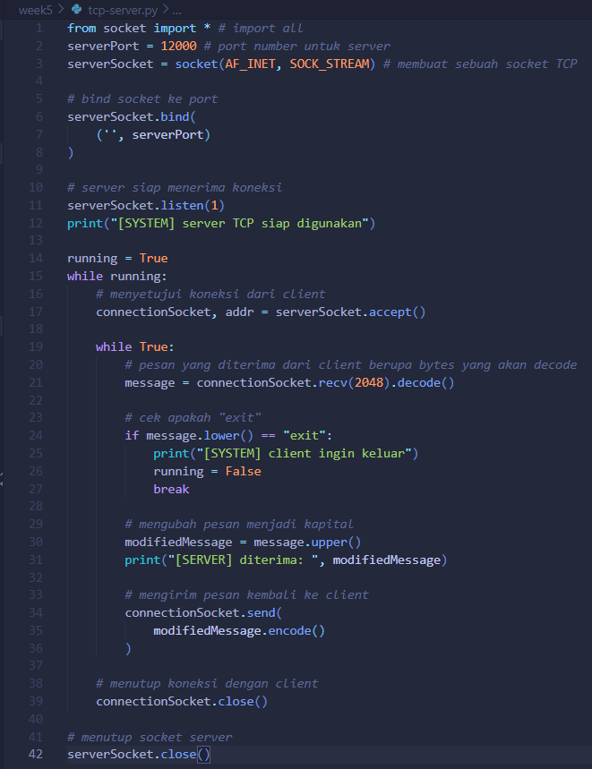

# Laporan Praktikum Week 5

<pre>
Nama        : Ivan Radithya Tanaya Ardianto
NIM         : 103072430005
Kelas       : IF-04-05
Mata Kuliah : Jaringan Komputer
</pre>
__________________________________________

 

## Socket Programming: Membuat Aplikasi Jaringan

Aplikasi yang terdiri dari sepasang program yaitu klien dan server yang berjalan di dua sistem berbeda dan berkomunikasi melalui socket. Socket dianalogikan sebagai "pintu" yang menghubungkan proses aplikasi dengan jaringan. Ada dua jenis network application: yang mengikuti standar terbuka (seperti RFC) dan yang bersifat proprietary.

### Program Socket dengan UDP
Aplikasi sederhana yang dibuat bekerja seperti:
1. Klien membaca input dari keyboard dan mengrimkannya ke server.
2. Server mengubah teks menjadi huruf kapital.
3. Server mengirim balik hasilnya ke klien.
4. Klien menampilkan hasilnya.

Output klien & server:
 

#### udp-client\.py

<strong>udp-client.py</strong> membuat socket bertipe <kbd>SOCK_DGRAM</kbd>, lalu menggunakan <kbd>sendto()</kbd> untuk mengrim data beserta alamat tujuan. Setelah itu, menunggu respon dengan <kbd>recvfrom()</kbd>. Yang harus diperhatikan pada UDP klien harus secara eksplisit melampirkan alaamat tujuan ke setiap paket karena UDP tidak memiliki koneksi tetap.

Code:
 

#### udp-server\.py

<strong>udp-server.py</strong> membuat socket serupa, lalu melakukan <kbd>bind()</kbd> ke port tertentu (12000) agar siap menerima paket. Server berjalan dalam loop yang menerima paket, mengubah ke huruf kapital, lalu mengirimkan kembali ke alamat klien.

Code:
 

### Program Socket dengan TCP
Berbeda dengan TCP yang harus beroientasi koneksi dengan klien dan server yang dilakukan three-way handshake sebelum data bisa kirim.

Output klien & server:
 

#### tcp-client\.py

<strong>tcp-client.py</strong> membuat socket bertipe <kbd>SOCK_STREAM</kbd>, kemudian memanggil <kbd>connect()</kbd> untuk memulai koneksi TCP. Data cukup dikirim dengan <kbd>send()</kbd> tanpa perlu melampirkan alamat tujuan, karena koneksi sudah terbentuk.

Code:
 

#### tcp-server\.py

<strong>tcp-server.py</strong> memiliki dua socket yaitu welcoming socket (<kbd>serverSocket</kbd>) dan <kbd>connectionSocket</kbd> yang dibuat khusus untuk setiap klien saat <kbd>accept()</kbd> dipanggil.

Code:
 