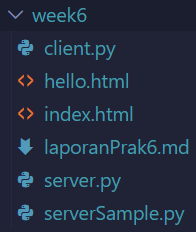
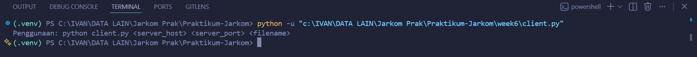
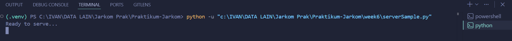
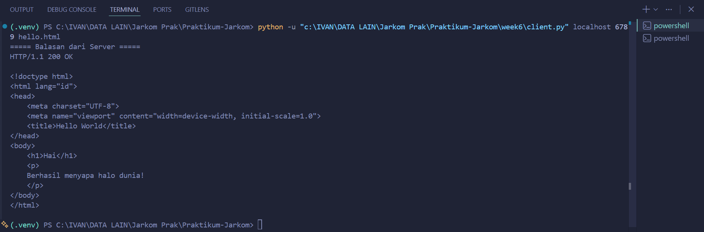
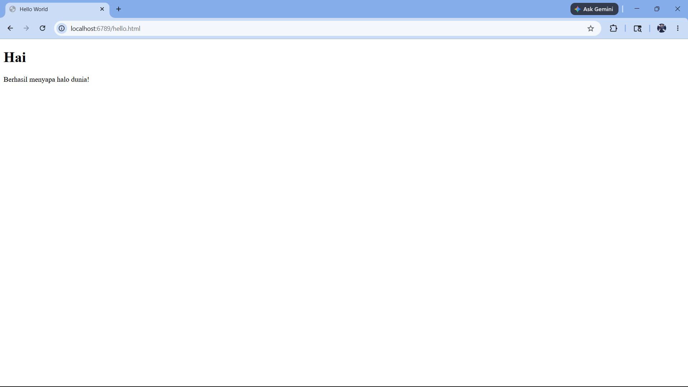
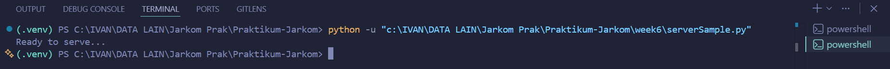
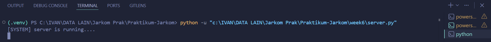
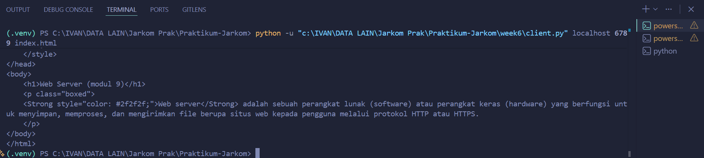
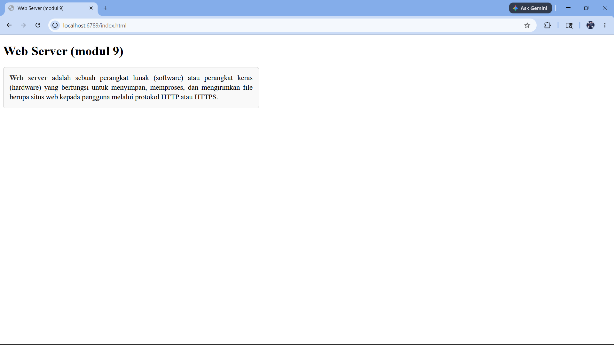
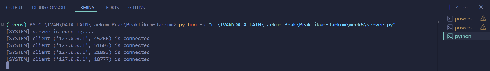

# Laporan Praktikum Week 6

<pre>
Nama        : Ivan Radithya Tanaya Ardianto
NIM         : 103072430005
Kelas       : IF-04-05
Mata Kuliah : Jaringan Komputer
</pre>
__________________________________________

<br>

## Web Server (modul 9)
<p align="justify">
Web server adalah sebuah perangkat lunak (software) atau perangkat keras (hardware) yang berfungsi untuk menyimpan, memproses, dan mengirimkan file berupa situs web kepada pengguna melalui protokol HTTP atau HTTPS.
</p>

### Kode

**serverSample\.py** (single thread)
```python
from socket import *
import sys # untuk melakukan exit program dengan sys.exit()

# membuat socket
serverSocket = socket(AF_INET, SOCK_STREAM)
serverPort = 6789
serverSocket.bind(('', serverPort))
serverSocket.listen(1) # menerima maksimal satu koneksi client

while True:
    print('Ready to serve...')
    
    # menerima koneksi dari client
    connectionSocket, addr = serverSocket.accept()
    
    try:
        # menerima pesan HTTP request dari client
        message = connectionSocket.recv(1024).decode()
        if not message:
            continue
            
        # index.html, hello.html
        # message = /GET /index.html HTTP /1.1
        # mengambil baris /index.html
        message = message.split()[1]
        
        # membuka index.html serta menghilangkan "/"
        filename = message[1:]
        f = open("week6/"+filename, "r")
        outputData = f.read()
        
        # kirim respon HTTP 200 OK ke client
        connectionSocket.send(
            "HTTP/1.1 200 OK\r\n\r\n".encode()
        )
        
        # mengirimkan isi file ke client
        for i in range(0, len(outputData)): 
            connectionSocket.send(outputData[i].encode())
        connectionSocket.send("\r\n".encode())
        
        # menutup koneksi dengan client
        connectionSocket.close()
        
    except IOError:
        # mengirimkan response 404 jika file tidak ada di direktori
        connectionSocket.send(
            "HTTP/1.1 404 Not Found\r\n\r\n".encode()
        )
        connectionSocket.send(
            "<html><body><h1>404 Not Found</h1></body></html>\r\n".encode()
        )
        
        # menutup koneksi dengan client
        connectionSocket.close()

    # menutup server socket setelah selesai melayani satu client
    serverSocket.close()
    sys.exit() # keluar dari program setelah selesai melayani satu client
```
<br>

**server\.py** (multi thread) maksimal 5 klien bisa masuk secara bersamaan
```python
from socket import *
import threading # membuat thread untuk menangani banyak client

def handle_client(connectionSocket):
    try:
        # menerima pesan user
        message = connectionSocket.recv(1024).decode()

        # jika pesan user tidak kosong
        if not message:
            connectionSocket.close()
            return

        # index.html, hello.html
        # message = /GET /index.html HTTP /1.1
        # mengambil baris /index.html
        message = message.split()[1]
        
        # membuka index.html serta menghilangkan "/"
        filename = message[1:]
        f = open("week6/"+filename, "r")
        outputData = f.read()
        
        # kirim respon
        connectionSocket.send(
            "HTTP/1.1 200 OK\r\n\r\n".encode()
        )

        # kirim data
        connectionSocket.sendall(outputData.encode())

        # tutup koneksi
        connectionSocket.close()

    except IOError:
        # kirim respon bila tidak ditemukan
        connectionSocket.send(
            "HTTP/1.1 404 Not Found\r\n\r\n".encode()
        )

        # kirim data 404
        connectionSocket.send(
            "<html><body><h1>404 Not Found</h1></body></html>".encode()
        )

        # tutup koneksi
        connectionSocket.close()

# membuat socket
serverSocket = socket(AF_INET, SOCK_STREAM)
serverPort = 6789
serverSocket.bind(('', serverPort))
serverSocket.listen(5) # dapat menerima sebanyak lima client
print("[SYSTEM] server is running....")

while True:
    connectionSocket, addr = serverSocket.accept()
    print(f"[SYSTEM] client {addr} is connected")
    
    # membuat thread dan target thread, beserta parameternya
    thread = threading.Thread(
        target=handle_client,
        args=(connectionSocket,)
    )
    # menjalankan
    thread.start()
```
<br>

**client\.py** (dengan tiga argumen)
```python
import sys
from socket import *

# Memastikan argumen yang dimasukkan di terminal sesuai format
if len(sys.argv) != 4:
    print(
        "Penggunaan: python client.py <server_host> <server_port> <filename>"
    )
    sys.exit()

server_host = sys.argv[1]
server_port = int(sys.argv[2])
filename = sys.argv[3]

clientSocket = socket(AF_INET, SOCK_STREAM)

try:
    # Membuka koneksi TCP ke server
    clientSocket.connect((server_host, server_port))
    
    # Membuat format pesan HTTP GET request
    request = f"GET /{filename} HTTP/1.1\r\nHost: {server_host}\r\n\r\n"
    clientSocket.send(request.encode())
    
    # Menerima respons dari server
    response = ""
    while True:
        recv_data = clientSocket.recv(1024).decode()
        if not recv_data:
            break
        response += recv_data
        
    print("===== Balasan dari Server =====")
    print(response)
    
except Exception as e:
    print(f"Koneksi gagal: {e}")
finally:
    clientSocket.close() # Menutup koneksi dengan server

```
<br>

**index.html**
```html
<!doctype html>
<html lang="id">
<head>
    <meta charset="UTF-8">
    <meta name="viewport" content="width=device-width, initial-scale=1.0">
    <title>Web Server (modul 9)</title>
    <style>
        .boxed {
            border: 1px solid #ccc;
            border-radius: 6px;
            padding: 15px;
            margin-right: 200px;
            width: 40%;
            background-color: #f9f9f9;
            text-align: justify;
            font-size: 18px;
            line-height: 24px;
        }
    </style>
</head>
<body>
    <h1>Web Server (modul 9)</h1>
    <p class="boxed">
    <Strong style="color: #2f2f2f;">Web server</Strong> adalah sebuah perangkat lunak (software) atau perangkat keras (hardware) yang berfungsi untuk menyimpan, memproses, dan mengirimkan file berupa situs web kepada pengguna melalui protokol HTTP atau HTTPS.
    </p>
</body>
</html>
```
<br>

**hello.html**
```html
<!doctype html>
<html lang="id">
<head>
    <meta charset="UTF-8">
    <meta name="viewport" content="width=device-width, initial-scale=1.0">
    <title>Hello World</title>
</head>
<body>
    <h1>Hai</h1>
    <p>
    Berhasil menyapa halo dunia!
    </p>
</body>
</html>
```

### Menjalankan Server
<br>
Pada bagian ini mengharuskan kode server dan client untuk berjalan di folder atau direkktori yang sama.

Selanjutnya run `client.py`.

`client.py` meminta argumen seperti server host, server port, dan nama.

Tapi sebelum itu, run `serverSample.py` di terminal lain.


Kemudian, kembali ke terminal untuk run `client.py`, lalu run dengan menambahkan tiga argumen `localhost 6789 hello.html`.


Lalu buka browser dan ketikan `http://localhost:6789/hello.html`.


Pada terminal `serverSample.py`, server akan berhenti saat sudah menampung 1 client.


#### Tugas Tambahan
pertama, run `server.py` di terminal lain.


Kemudian, kembali ke terminal untuk run `client.py`, lalu run dengan menambahkan tiga argumen `localhost 6789 index.html`.


Lalu buka browser dan ketikkan `http://localhost:6789/index.html`.


Pada terminal `server.py`, server akan terus berjalan selama yang membuka server tidak lebih dari 5 klien.


#### Kesimpulan
<p align="justify">
Untuk single thread lebih rentan terkena backlog (antrean koneksi yang belum ter-accept oleh server) daripada multi thread, karena dengan thread yang lebih banyak bisa mengosongkan backlog terlebih dahulu sebelum menerima klien lagi.
</p>