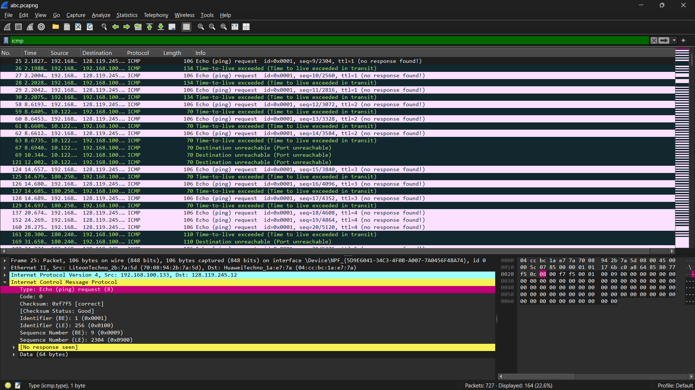
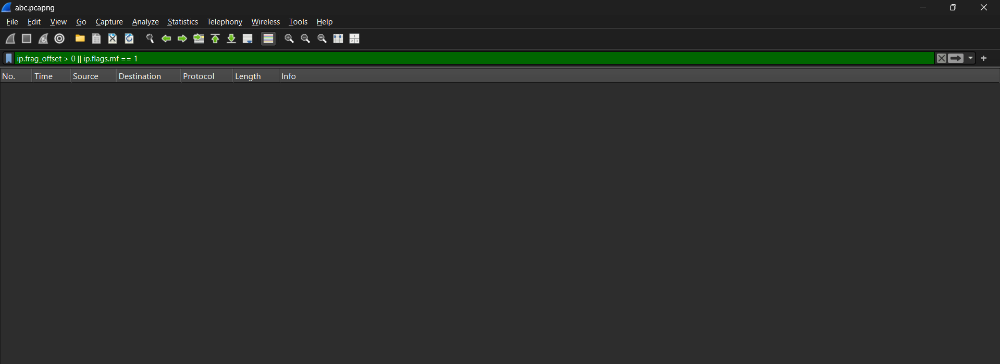
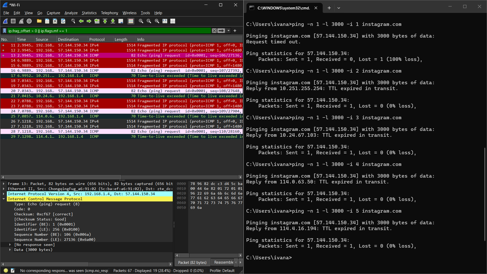
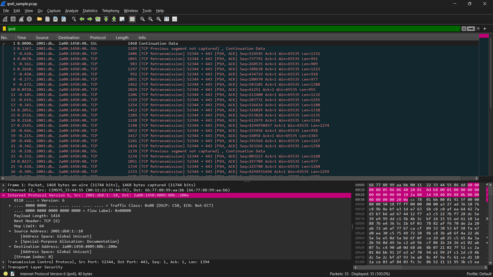
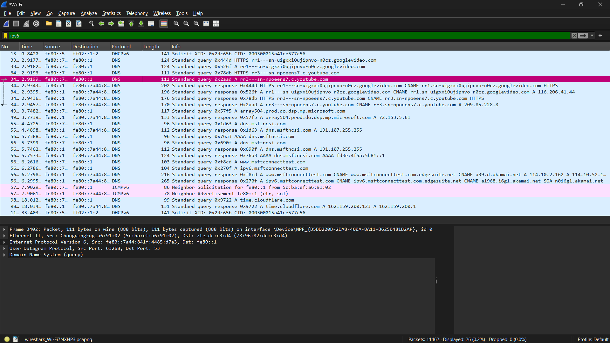

# Laporan Praktikum Week 7

<pre>
Nama        : Ivan Radithya Tanaya Ardianto
NIM         : 103072430005
Kelas       : IF-04-05
Mata Kuliah : Jaringan Komputer
</pre>
__________________________________________

 

## IP (Modul 10)

Jawabanlah pertanyaan berikut.
1. Apa itu IP address?
2. Traceroute dari suatu website.
3. Apa itu ICMP, MTU, TTL?
4. Cari contoh Fragmentasi di wireshark kalian!
5. Carilah IPv6 di wireshark yang kalian lakukan!

### IP Address

IP (Internet Protocol) address adalah identitas numerik yang diberikan kepada setiap perangkat yang terhubung ke jaringan komputer menggunakan protokol IP. IP address berfungsi untuk mengidentifikasi lokasi perangkat (host) dalam jaringan dan memungkinkan pengiriman data dari sumber ke tujuan.

Ada dua jenis IP:
<ul>
    <li>
    IPv4: 32 bit, ditulis sebagai empat angka desimal (misalnya 192.168.1.1).
    </li>
    <li>
    IPv6: 128 bit, ditulis dalam heksadesimal (misalnya fe80::1ff:fe23:4567:890a).
    </li>
</ul>
 

IP address terdapat dalam header datagram IP dan menjadi isi dari field <kbd>Source</kbd> (sumber) dan <kbd>Destination</kbd> (tujuan) pada paket yang ditangkap wireshark.

### Menangkap Traceroute Dari Suatu Website

Traceroute adalah program yang digunakan untuk melacak rute (jalur) yang dilalui oleh paket dari komputer sumber menuju server tujuan.

Cara kerjanya:
<ul>
    <li>
    Program mengirimkan datagram dengan nilai TTL (Time to Live) yang dinaikkan secara bertahap (seperti TTL = 1, 2, 3, dst).
    </li>
    <li>
    Setiap router yang dilalui akan mengurangi TTL sebesar 1. Jika TTL mencapai 0, router mengirimkan kembali pesan ICMP TTL-exceeded ke sumber.
    </li>
    <li>
    Dengan mengamati alamat IP dari pesan ICMP yang kembali, traceroute dapat menegetahui setiap hop (router) di sepanjang jalur.
    </li>
</ul>
Perintahnya seperti:
<ul>
    <li>
    Linux/Mac: <kbd>traceroute alamat domain  2000</kbd>
    </li>
    <li>
    Windows: <kbd>tracert alamat domain</kbd>
    </li>
</ul>

### Apa Itu ICMP, MTU, TTL?

<Strong>ICMP</strong> (Internet Message Protocol) adalah protokol yang digunakan untuk pengiriman pesan kesalahan dan informasi kontrol dalam jaringan IP.

<Strong>MTU</Strong> (Maximum Transmission Unit) adalah ukuran maksimum dari sebuah paket (frame) yang dapat dikirim melalui suatu antarmuka jaringan dalam satu kali transmisi. Jika ukuran datagram melebihi MTU suatu link, makan akan terjadi fragmentasi (pemecahan) menjadi beberapa datagaram yang lebih kecil.

<Strong>TTL</Strong> (Time to Live) adalah field header IP (nilai awal maksimal 255). Setiap router wajib mengurangi TTL setidaknya 1. Jika TTL menjadi 0, router akan membuang paket tersebut dan mengirim pesan ICMP "Time-to-live Exceeded" ke pengirim. TTL berguna untuk mencegah paket berputar tanpa batas di jaringan.

Contoh:
 

### Contoh Fragmentasi di Wireshark
Dengan menggunakan file yang diberikan (abc.pcapng).

 0 || ip.flags.mf == 1">
Dengan filter <kbd>ip.frag_offset > 0 || ip.flags.mf == 1</kbd>, yang digunakan untuk menangkap semua fragmen pada paket. Kalau hanya menggunakan <kbd>ip.frag_offset > 0</kbd>, hanya bisa menangkap fragmen selanjutnya sampai fragmen terakhir (fragmen pertama tidak akan ditampilkan) pada paket. Sedangkan kalau hanya menggunakan <kbd>ip.flags.mf == 1</kbd>, hanya bisa menangkap fragmen pertama hingga sebelum fragmen terakhir (fragmen terakhir tidak akan ditampilkan) pada paket.

 

Dengan perintah <kbd>ping</kbd> di CMD sebesar 3000 byte untuk Instagram.

 0 || ip.flags.mf == 1">
Dengan menggunakan perintah <kbd>for /l %i in (1,1,5) do ping -n 1 -l 3000 -i %i instagram.com</kbd> akan melalukan hop sebanyak 5 kali dengan meminta mengirimkan paket sebesar 3000 byte.

### Tangkapan Paket IPv6 di Wireshark
Dengan menggunakan file yang diberikan (ipv6_sample.pcap).

IP address yang digunakan global karena IP diawali <kbd>2001:</kbd> atau <kbd>2404:</kbd>.

Dengan menangkap paket pada Youtube.

IP address yang digunakan bukan global (lokal) karena IP diawali <kbd>fe80::</kbd>. Dengan response yang dikembalikan alamat <kbd>A</kbd> dan bukan <kbd>AAAA</kbd>.