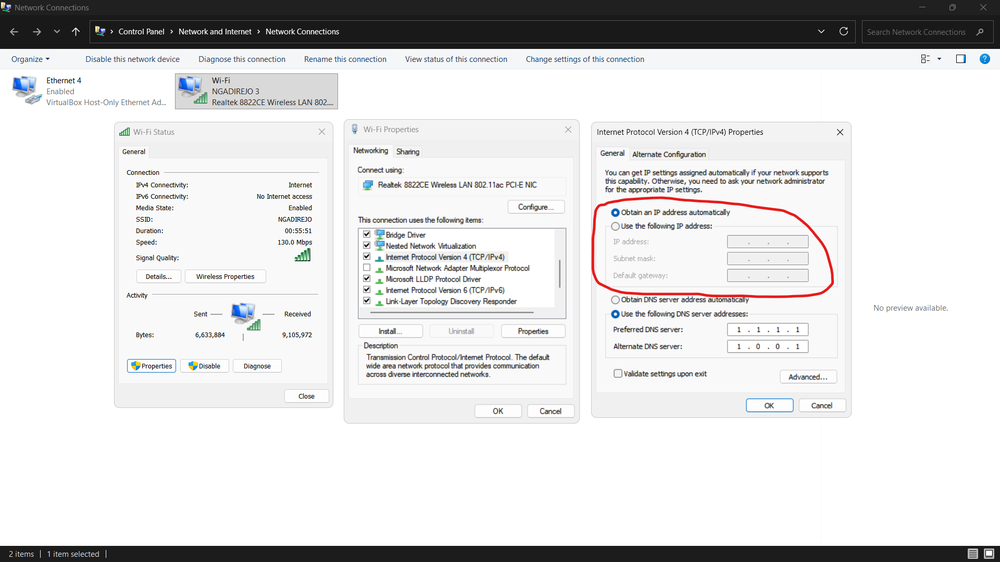
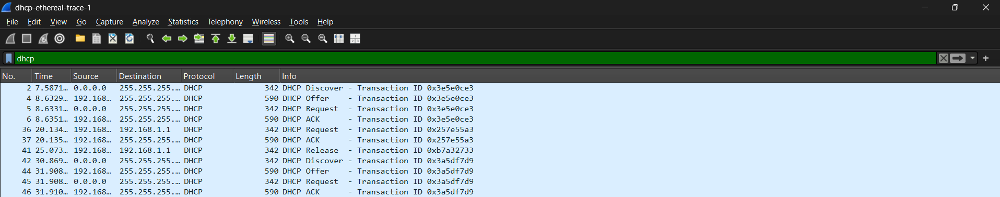

# Laporan Praktikum Week 9

<pre>
Nama        : Ivan Radithya Tanaya Ardianto
NIM         : 103072430005
Kelas       : IF-04-05
Mata Kuliah : Jaringan Komputer
</pre>
__________________________________________

 

##  DHCP (modul 11)

Jawabanlah pertanyaan berikut.
1. Apa itu DHCP?
2. Apa kelebihan dan kekurangan DHCP?
3. Apa itu DORA?

### Pengertian DHCP

DHCP (Dynamic Host Configuration Protocol) adalah protokol yang digunakan secara luas di perusahaan, universitas, dan jaringan LAN (baik kabel maupun nirkabel) untuk secara luas di perusahaan, universitas, dan jaringan LAN (baik kabel maupun nirkabel) untuk secara dinamis menetapkan alamat IP kepada host, serta untuk mengkonfigurasi informasi jaringan lainnya.

Pengaturan otomatis perangkat (laptop) untuk mendapatkan alamat IP secara dinamis.

<Strong>Untuk Windows:</Strong> search <kbd>view network connections</kbd> &rarr; <em>double click</em> <kbd>Wi-Fi</kbd> &rarr; <em>click</em> <kbd>Properties</kbd> &rarr; <em>scroll</em> sampai menemukan tulisan <kbd>Internet Protocol Version 4 (TCP/IPv4)</kbd>, kemudian <em>double click</em>.

Pada setingan defaultnya IP address akan dilakukan secara dynamic (dinamis) bukan static.

### Kelebihan & Kekurangan DHCP
Kelebihan dab kekurangan DCHP sebagai berikut.
| Kelebihan | Kekurangan |
|-----------|------------|
| 
<Strong>Otomatisasi:</Strong> Memudahkan administrator jaringan dalam mengelola pengalamatan IP tanpa perlu melakukan konfigurasi manual pada setiap perangkat.
 | 
<Strong>Ketergantungan pada server:</Strong> Jika server DHCP mengalami kegagalan, perangkat baru tidak dapat memperoleh alamat IP, dan perangkat yang ada mungkin kehilangan konektivitas saat masa sewa (lease) berakhir.
 |
| 
<Strong>Efiensi penggunaan IP:</Strong> Alamat IP yang tidak digunakan dapat "dipinjamkan" kembali ke kumpulan alamat (pool) untuk dialokasikan ke perangkat lain (menghemat jumlah alamat IP yang digunakan).
 | 
<Strong>Potensi konflik IP:</Strong> Jika terjadi kesalahan konfigurasi pada server atau jaringan, protokol ini berpotensi menyebabkan duplikasi alamat IP.
 |
| 
<Strong>Mengurangi kesalahan konfigurasi:</Strong> Sistem terpusat meminimalkan risiko kesalahan input saat mengisi pengaturan IP, subnet mask, gateway, dan DNS secara manual
 | 
<Strong>Keamanan:</Strong> DHCP dapat menjadi celah keamanan jika tidak dikelola dengan baik, misalnya jika server DHCP tidak sah (rogue DHCP server) ditempatkan di jaringan.
 |
| 
<Strong>Mobilitas:</Strong> Perangkat (seperti laptop dan handphone) dapat dengan mudah berpindah anatar jaringan yang berbeda tanpa perlu mengubah konfigurasi IP secar manual.
 | 
<Strong>Overhead jaringan:</Strong> Proses negosiasi (Discover, Offer, Request, ACK) menimbulkan lalu lintas broadcast (siaran) pada jaringan, yang dapat memengaruhi kinerja pada jaringan berskala besar.
 |

### DORA
DORA (Discover, Offer, Request, ACK) merujuk pada empat jenis pesan DHCP yang dipertukarkan antara klien dan server untuk menyelesaikan porses pemberian alamat IP.

Berikut penjelasan untuk empat jenis pesan DHCP:
<Strong>Discover:</Strong> Pesan yang dikirimkan oleh klien untuk mencari server DHCP yang tersedia.
<Strong>Offer:</Strong> Pesan yang dikirimkan oleh server sebagai tanggapan atas pesan Discover, berisi penawaran alamat IP.
<Strong>Request:</Strong> Pesan yang dikirimkan oleh klien untuk meminta alamat IP yang telah ditawarkan olehs server.
<Strong>ACK (Acknowledgment):</Strong> Pesan yang dikirimkan oleh server sebagai konfirmasi bahwa alamt IP telah berhasil dialokasikan kepada klien, beserta parameter konfigurasi jaringan lainnya.

Contoh dengan file dari http://gaia.cs.umass.edu/wireshark-labs/wireshark-traces.zip dengan nama <kbd>dhcp-ethereal-trace-1</kbd>:

 
Pertama untuk pesan DHCP Discover, perangkat baru akan broadcast di jaringan mencari DHCP karena belum punya alamat IP. Kemudian untuk pesan DHCP Offer, server akan mendengar broadcast dari perangkat tersebut, lalu akan menawarkan satu alamat IP yang tersedia. Untuk pesan DHCP request, perangkat setuju dan secara resmi meminta IP yang ditawarkan tadi. Kemudian pesan DHCP ACK, server mencatat dan memberikan lampu hijau agar IP tersebut bisa digunakan.

Selain itu, ada proses Renewal (ketika perangkat meminta izin pakai IP lebih lama (pada nomor 36, 37)) dan proses Release (perangkat "pamit" dan mengembalikan IP ke server (agar dapat digunakan perangkat lain) (pada nomor 41)).

